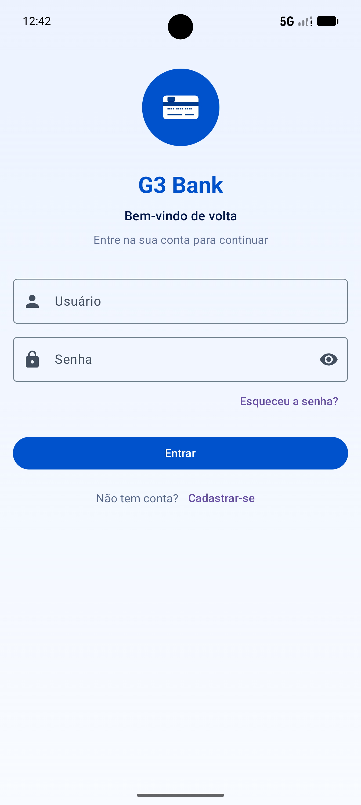
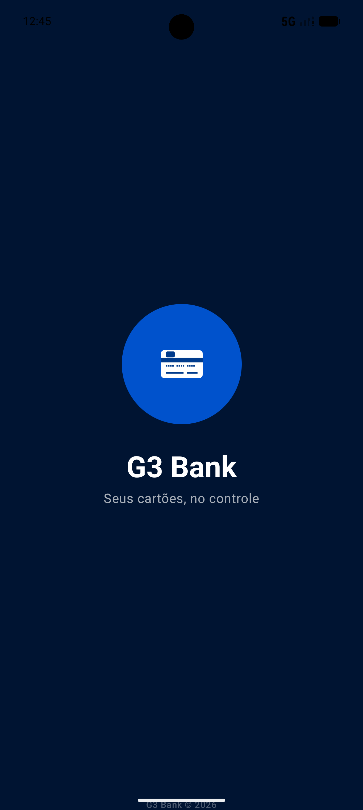
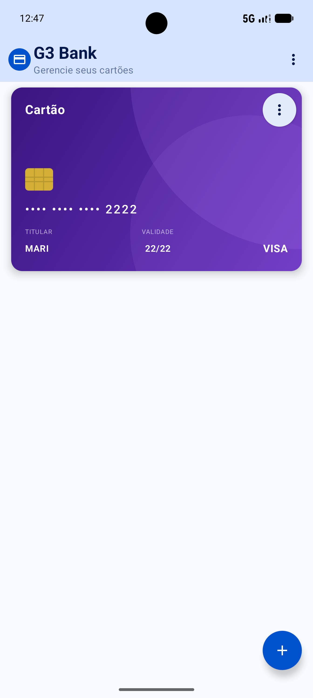
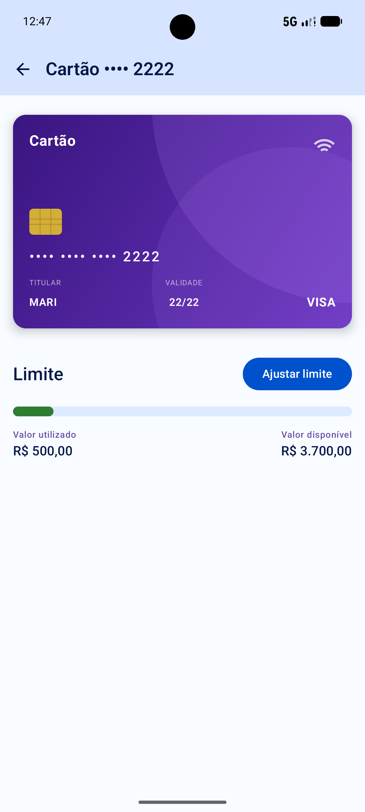
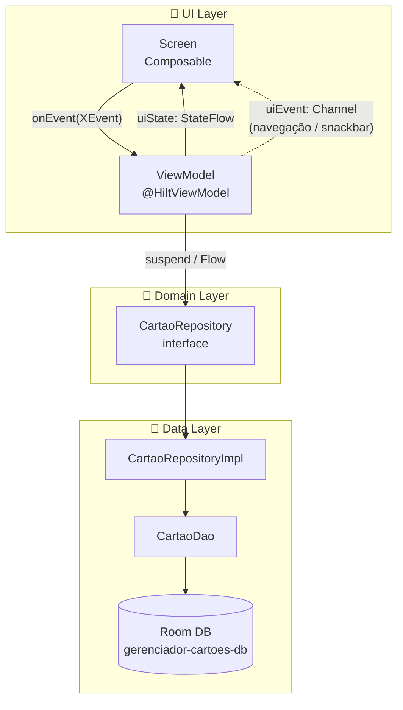
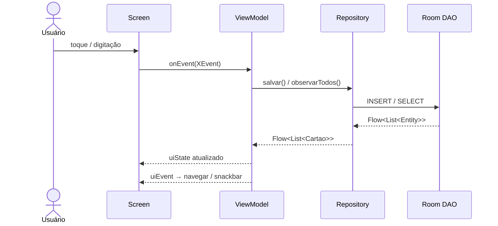

<h1 align="center">💳 G3 Bank</h1>

<p align="center">
  <strong>Seus cartões, no controle.</strong><br/>
  Aplicativo Android nativo para gerenciamento de cartões de crédito.
</p>

<p align="center">
  
  
  
  
  
  
</p>

<p align="center">
  <strong>👥 Equipe</strong><br/><br/>
  Caio Albuquerque &nbsp;·&nbsp;
  Fabio de Oliveira &nbsp;·&nbsp;
  Felipe Suzuki &nbsp;·&nbsp;
  Gustavo de Souza &nbsp;·&nbsp;
  Rafael Alexandre &nbsp;·&nbsp;
  Victor Vieira
</p>

---

## 📱 Sobre o App

**G3 Bank** é um aplicativo Android que permite ao usuário **cadastrar, visualizar, editar e excluir** seus cartões de crédito em um único lugar. O projeto utiliza as tecnologias mais modernas do ecossistema Android, seguindo arquitetura **MVVM estrita com Fluxo de Dados Unidirecional (UDF)**.

> Desenvolvido como projeto de conclusão de curso Android, demonstrando boas práticas de engenharia de software mobile.

---

## ✨ Funcionalidades

| Funcionalidade | Descrição |
|---|---|
| 📋 **Lista de cartões** | Visualize todos os seus cartões em cards visuais ricos |
| ➕ **Cadastro** | Adicione novos cartões com titular, número, bandeira, validade e limite |
| ✏️ **Edição** | Edite qualquer informação de um cartão existente |
| 🗑️ **Exclusão** | Remova cartões com confirmação de segurança |
| 🔍 **Detalhe** | Veja informações completas de cada cartão |
| 🌙 **Dark Mode** | Suporte completo a tema claro e escuro |
| 💾 **Offline-first** | Todos os dados persistidos localmente via Room |
| 🔐 **Sessão** | Login com fluxo de autenticação e logout seguro |
| 🎨 **Design System** | Tema Material Design 3 com identidade visual G3 Bank |

---

## 🖼️ Capturas de Tela

| | | | |
|:---:|:---:|:---:|:---:|
|  |  |  |  |

---

## 🛠️ Stack Tecnológica

### Core
| Tecnologia | Uso |
|---|---|
| **Kotlin** (K2) | Linguagem principal |
| **Jetpack Compose** | UI declarativa |
| **Material Design 3** | Design system |
| **KSP** | Processamento de anotações (substitui KAPT) |

### Arquitetura & DI
| Tecnologia | Uso |
|---|---|
| **Hilt** | Injeção de dependência |
| **ViewModel** | Gerenciamento de estado |
| **Navigation Compose** | Navegação type-safe com `@Serializable` |

### Persistência
| Tecnologia | Uso |
|---|---|
| **Room** | Banco de dados local SQLite reativo |

### Rede *(infraestrutura provisionada)*
| Tecnologia | Uso |
|---|---|
| **Retrofit** | Cliente HTTP type-safe |
| **OkHttp** | Interceptor de logging |
| **kotlinx-serialization** | Serialização JSON + rotas |

---

## 🏗️ Arquitetura

O projeto segue **MVVM estrito com Fluxo de Dados Unidirecional (UDF)**:





**Princípios aplicados:**
- 🔒 **Separação de camadas** — UI nunca acessa `CartaoEntity` ou `CartaoDao` diretamente
- 🔄 **Reatividade** — `Flow<List<Cartao>>` do Room propaga mudanças automaticamente para a UI
- 🎯 **UDF** — estado imutável (`StateFlow`), mutação via `_uiState.update { it.copy(...) }`
- 📡 **Eventos one-shot** — navegação e Snackbar via `Channel<UiEvent>(BUFFERED)`, nunca `StateFlow`

---

## 🗂️ Estrutura do Projeto

```
app/src/main/
└── com.app.gerenciadorcartoes/
    ├── 📱 GerenciadorCartoesApp.kt   # @HiltAndroidApp
    ├── 📱 MainActivity.kt            # @AndroidEntryPoint · Splash Screen
    │
    ├── 🎯 model/
    │   └── Cartao.kt                 # Modelo de domínio puro
    │
    ├── 💾 data/local/
    │   ├── dao/CartaoDao.kt          # Queries Room reativas
    │   ├── database/AppDatabase.kt   # @Database
    │   └── entity/CartaoEntity.kt    # @Entity
    │
    ├── 🔗 repository/
    │   ├── CartaoRepository.kt       # Interface de domínio
    │   ├── CartaoRepositoryImpl.kt   # Implementação local
    │   └── mapper/CartaoMapper.kt    # Entity ↔ Domain
    │
    ├── 🌐 network/
    │   └── service/ApiService.kt     # Retrofit (endpoints futuros)
    │
    ├── 💉 di/
    │   ├── AppModule.kt              # Room · Repository
    │   └── NetworkModule.kt          # Retrofit · OkHttp
    │
    └── 🎨 ui/
        ├── theme/                    # Design system: cores, tipo, espaçamento
        ├── components/               # Componentes compartilhados
        ├── navigation/               # Rotas type-safe · NavHost
        ├── feature/
        │   ├── splash/               # Tela de splash animada
        │   ├── login/                # Autenticação
        │   ├── lista/                # CRUD — listagem
        │   ├── detalhe/              # CRUD — detalhe
        │   └── cadastraralterar/     # CRUD — criar / editar
        └── viewmodel/                # Todos os ViewModels
```

---

## 🚀 Como Executar

### Pré-requisitos

- **Android Studio** Hedgehog ou superior
- **JDK 17+**
- **Android SDK** API 28+

### Passos

```bash
# 1. Clone o repositório
git clone https://github.com/seu-usuario/g3-bank.git
cd g3-bank

# 2. Abra no Android Studio
# File → Open → selecione a pasta do projeto

# 3. Sincronize o Gradle
# Android Studio sincroniza automaticamente ao abrir

# 4. Execute no emulador ou dispositivo (API 28+)
# Clique em ▶ Run  ou  Shift + F10
```

> **Nota:** O app roda completamente offline. Nenhuma configuração de API key ou servidor é necessária.

---

## 🌐 APIs

O projeto consome a seguinte API externa:

### 📮 ViaCEP — Consulta de CEP

> API pública e gratuita do Brasil para consulta de endereços a partir do CEP.

| Campo | Valor |
|---|---|
| **Base URL** | `https://viacep.com.br/ws/` |
| **Autenticação** | Nenhuma |
| **Conversor** | Gson |
| **Timeout** | 30s |

**Endpoint:**

```
GET {cep}/json/
```

**Campos consumidos pelo app:**

| Campo JSON | Tipo | Descrição |
|---|---|---|
| `logradouro` | `String` | Nome da rua / avenida |
| `bairro` | `String` | Bairro |
| `uf` | `String` | Sigla do estado (ex: `SP`, `RJ`) |

**Exemplo de chamada:**
```
GET https://viacep.com.br/ws/01310100/json/
```

**Exemplo de resposta:**
```json
{
  "logradouro": "Avenida Paulista",
  "bairro": "Bela Vista",
  "uf": "SP"
}
```

---

## 🎨 Design System

Tema **Material Design 3** com identidade G3 Bank:

| Token | Light | Dark | Uso |
|---|---|---|---|
| `primary` | `#0052CC` | `#ADC6FF` | Ações principais, FAB, círculo da marca |
| `primaryContainer` | `#D6E4FF` | `#003B8C` | Fundo da TopAppBar no light |
| `tertiary` | `#6750A4` | `#CDB4FF` | Labels de acento, roxo harmonioso com os cartões |
| `background` | `#F8FBFF` | `#001432` | Navy profundo no modo escuro |

---

## 📚 Documentação

| Documento | Descrição |
|---|---|
| [📖 DEVELOPMENT.md](docs/DEVELOPMENT.md) | Stack detalhada, arquitetura, padrões MVVM e guias de desenvolvimento |
| [🏛️ ARCHITECTURE.md](docs/ARCHITECTURE.md) | Decisões arquiteturais e diagramas |
| [📋 PROJECT_CONTEXT.md](docs/PROJECT_CONTEXT.md) | Contexto do projeto e requisitos |
| [✍️ CODING_GUIDELINES.md](docs/CODING_GUIDELINES.md) | Convenções de código e boas práticas |
| [🤖 AI_CONTEXT.md](docs/AI_CONTEXT.md) | Contexto para assistentes de IA |

---

## 📋 Requisitos Técnicos

| Requisito | Valor |
|---|---|
| **Min SDK** | API 28 (Android 9.0 Pie) |
| **Target SDK** | API 36 |
| **Compile SDK** | API 36 |
| **Linguagem** | Kotlin 2.3.21 (compilador K2) |
| **Build System** | Gradle 9.x + AGP 9.0.0 |

---

## 📄 Licença

```
MIT License — Copyright (c) 2026 G3 Bank
```

---

<p align="center">
  Feito com ❤️ usando Kotlin e Jetpack Compose
</p>
