<h1 align="center">💳 G3 Bank</h1>

<p align="center">
  <strong>Seus cartões, no controle.</strong><br/>
  Aplicativo Android nativo para gerenciamento de cartões de crédito.
</p>

<p align="center">
  
  
  
  
  
  
</p>

<p align="center">
  <strong>👥 Equipe</strong><br/><br/>
  Caio Albuquerque &nbsp;·&nbsp;
  Fabio de Oliveira Sales &nbsp;·&nbsp;
  Felipe Suzuki &nbsp;·&nbsp;
  Gustavo de Souza &nbsp;·&nbsp;
  Rafael Alexandre &nbsp;·&nbsp;
  Victor Vieira
</p>

---

## Índice

- [Sobre o App](#-sobre-o-app)
- [Sobre o Projeto Acadêmico](#-sobre-o-projeto-acadêmico)
- [Funcionalidades](#-funcionalidades)
- [Capturas de Tela](#️-capturas-de-tela)
- [Fluxo de Telas](#️-fluxo-de-telas)
- [Arquitetura](#️-arquitetura)
  - [O que é MVVM?](#o-que-é-mvvm)
  - [O que é UDF — Fluxo de Dados Unidirecional?](#o-que-é-udf--fluxo-de-dados-unidirecional)
  - [As três camadas do app](#as-três-camadas-do-app)
  - [Como um clique do usuário vira uma mudança na tela](#como-um-clique-do-usuário-vira-uma-mudança-na-tela)
  - [Por que Channel para navegação e não StateFlow?](#por-que-channel-para-navegação-e-não-stateflow)
  - [Diagrama de dependências entre camadas](#diagrama-de-dependências-entre-camadas)
- [Stack Tecnológica](#️-stack-tecnológica)
  - [Por que não X?](#por-que-não-x)
- [Estrutura do Projeto](#️-estrutura-do-projeto)
  - [O papel de cada camada](#o-papel-de-cada-camada)
- [Banco de Dados](#️-banco-de-dados)
- [Sincronização Offline (WorkManager)](#-sincroniza%C3%A7%C3%A3o-offline-workmanager)
- [Segurança de Dados](#-segurança-de-dados)
- [Design System](#-design-system)
- [APIs Externas](#-apis-externas)
- [Como Executar](#-como-executar)
- [Padrões e Boas Práticas](#-padrões-e-boas-práticas)
- [Glossário](#-glossário)
- [Aprenda Mais](#-aprenda-mais)
- [Documentação Técnica](#-documentação-técnica)
- [Requisitos Técnicos](#-requisitos-técnicos)

---

## 📱 Sobre o App

**G3 Bank** é um aplicativo Android que permite ao usuário **cadastrar, visualizar, editar e excluir** seus cartões de crédito em um único lugar, com login seguro via Firebase Authentication.

O app é **offline-first**: todos os cartões ficam salvos localmente no celular (banco de dados Room), e a sessão do usuário é protegida com criptografia AES-256-GCM via Android Keystore. A internet só é necessária para login/cadastro e preenchimento automático de CEP.

> Desenvolvido como projeto de conclusão de curso Android, demonstrando boas práticas de engenharia de software mobile.

---

## 🎓 Sobre o Projeto Acadêmico

Este projeto foi construído para demonstrar, na prática, **como um app Android profissional é estruturado** — não apenas "o que ele faz", mas **por que cada decisão foi tomada**.

Se você está aprendendo Android, estudar este código vai te ensinar:

| O que você vai aprender | Onde encontrar no código |
|---|---|
| Como separar a lógica da tela (MVVM) | `ui/viewmodel/` e `ui/feature/` |
| Como o estado da tela é gerenciado de forma segura | `ListaUiState`, `DetalheUiState`, `CadastrarAlterarUiState` |
| Como eventos do usuário fluem pela arquitetura (UDF) | `ListaEvent`, `ListaViewModel.onEvent()`, `ListaScreen` |
| Como usar banco de dados local com Room | `data/local/dao/`, `data/local/entity/` |
| Como injetar dependências automaticamente com Hilt | `di/AppModule`, `di/AuthModule`, `di/NetworkModule` |
| Como navegar entre telas com tipo seguro | `ui/navigation/Routes.kt`, `ui/navigation/AppNavHost.kt` |
| Como proteger dados sensíveis no celular | `data/local/security/DataStoreEncryptor.kt` |
| Como integrar Firebase Authentication | `network/firebase/FirebaseAuthDataSource.kt` |
| Como consumir uma API REST com Retrofit | `network/service/BuscaCep.kt` |
| Como criar um Design System com tokens | `ui/theme/Spacing.kt`, `ui/theme/IconSize.kt`, `ui/theme/Color.kt` |

> **Dica para iniciantes:** não tente ler o projeto inteiro de uma vez. Comece pela tela de Lista (`ui/feature/lista/`) e siga o fluxo de um único evento — por exemplo, o clique no FAB "+" para criar um cartão — do começo ao fim. Isso vai mostrar como todas as camadas se conectam na prática.

---

## ✨ Funcionalidades

| Funcionalidade | Descrição |
|---|---|
| 🔐 **Cadastro de conta** | Crie uma conta com dados pessoais e endereço em etapas guiadas |
| 🔑 **Login e logout** | Entre com e-mail/senha ou conta Google; saia com segurança a qualquer momento |
| 🔁 **Recuperação de senha** | Receba um e-mail para redefinir sua senha (Firebase cuida de tudo) |
| 👤 **Perfil editável** | Atualize seus dados cadastrais pelo menu do app |
| 📋 **Lista de cartões** | Visualize todos os seus cartões em cards visuais ricos |
| ➕ **Adicionar cartão** | Cadastre cartões com titular, número, bandeira, validade e limite |
| 💰 **Ajustar limite** | Altere o limite de crédito de um cartão existente |
| ✏️ **Edição** | Edite qualquer informação de um cartão existente |
| 🗑️ **Exclusão** | Remova cartões com confirmação de segurança |
| 🔍 **Detalhe** | Veja informações completas de cada cartão |
| 📮 **CEP automático** | O endereço é preenchido automaticamente ao digitar o CEP (API ViaCEP) |
| 🌙 **Dark Mode** | Suporte completo a tema claro e escuro |
| 💾 **Offline-first** | Todos os dados ficam salvos no celular, sem precisar de internet |
| 🎨 **Design System** | Tema Material Design 3 com identidade visual G3 Bank |

---

## 🖼️ Capturas de Tela

Galeria das telas do app (organizada pelo fluxo do usuário).

| Login | Cadastro | Cadastro — Passo 1 | Cadastro — Passo 2 |
|:-----:|:--------:|:------------------:|:------------------:|
| 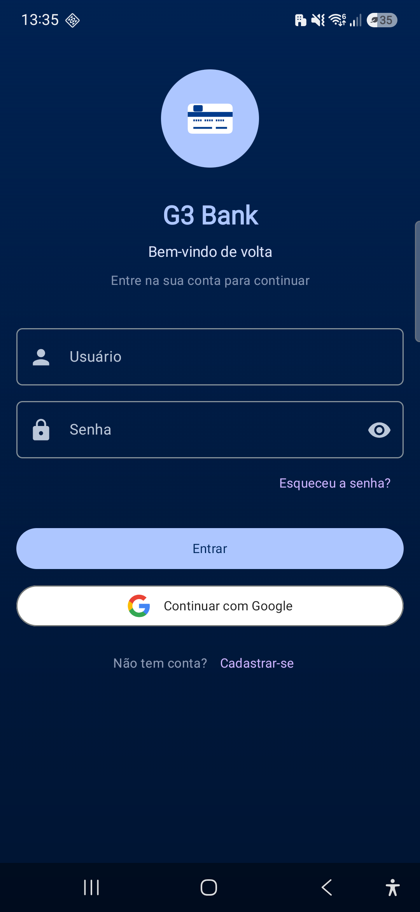 | 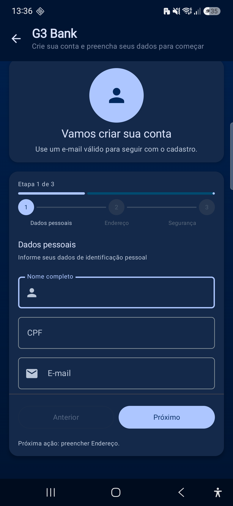 | 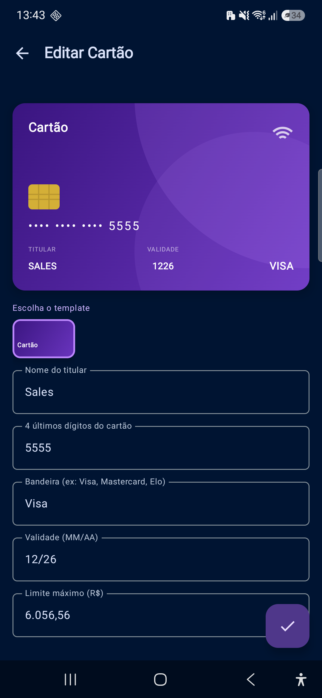 | 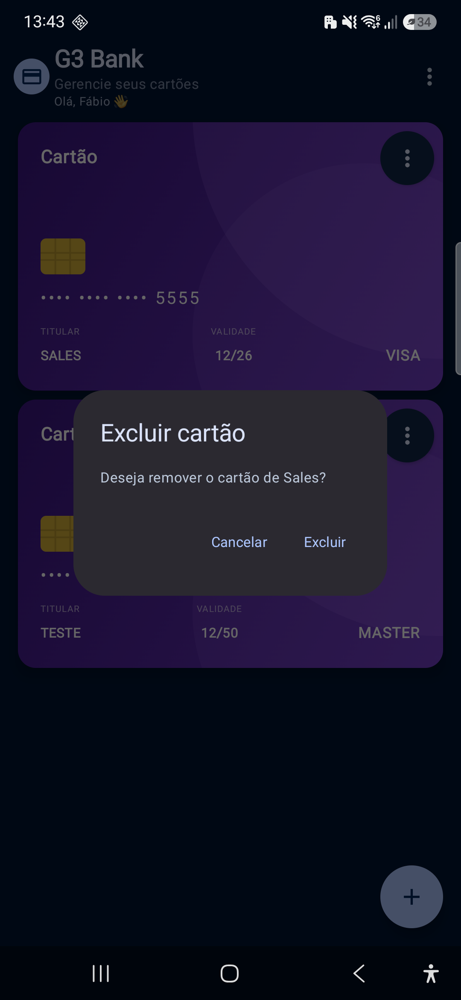 |

| Lista | Cartões (lista) | Menu / Ações | Logout (confirmação) |
|:-----:|:---------------:|:-----------:|:--------------------:|
| 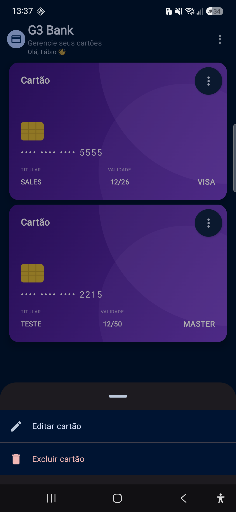 | 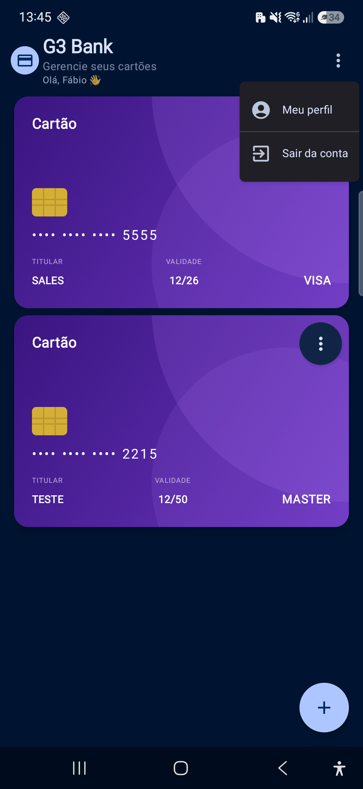 | 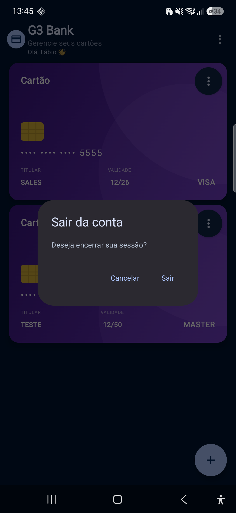 |  |

| Ajustar Limite | Faturas | Perfil |
|:---------------:|:-----:|:-----:|
| 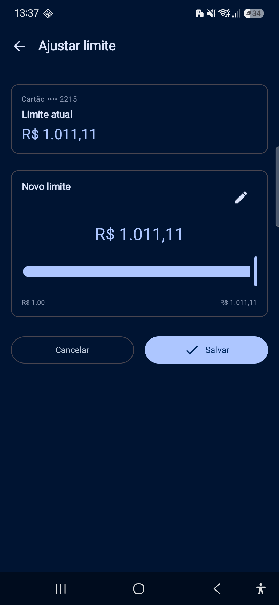 | 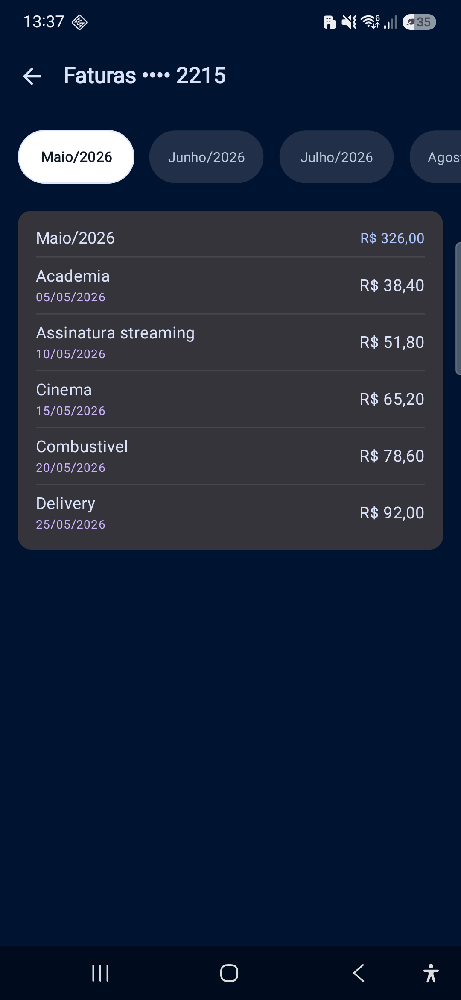 | 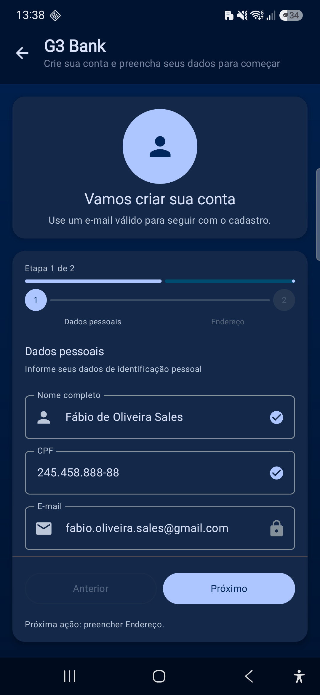 |
---

## 🗺️ Fluxo de Telas

O app começa sempre na tela de **Splash**, que verifica silenciosamente se há uma sessão ativa. A partir daí o usuário segue um dos dois caminhos abaixo.

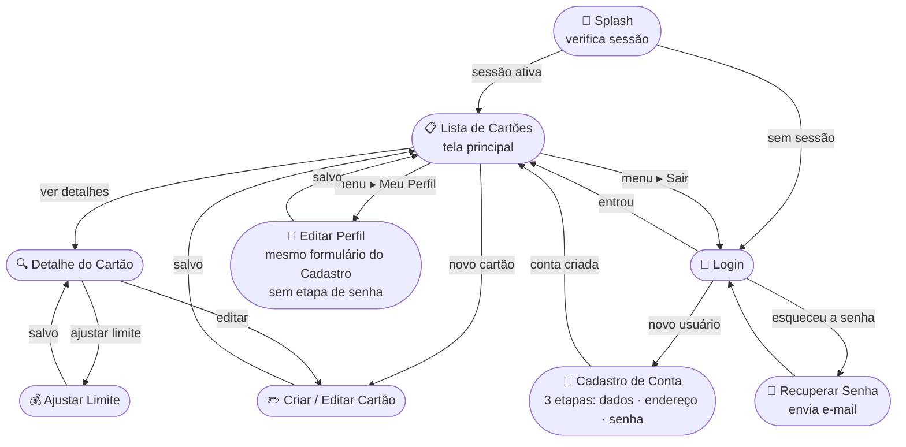

---

## 🛠️ Stack Tecnológica

> Todas as versões refletem o ecossistema Android estável em 2026.

### Linguagem e UI

| Tecnologia | Versão | Para que serve | Qual problema resolve |
|---|---|---|---|
| **Kotlin** K2 | 2.3.21 | Linguagem principal do app | Substitui Java com null safety nativo, coroutines integradas e código mais conciso |
| **Jetpack Compose** | BOM 2026.05.01 | Construção de telas | Elimina XML de layout e o ciclo manual `findViewById` + `setText` — você descreve *o que* mostrar, e o Compose cuida de *como* desenhar |
| **Material Design 3** | — | Sistema visual | Fornece cores, tipografia, formas e animações prontas e acessíveis |

### Arquitetura

| Tecnologia | Versão | Para que serve | Qual problema resolve |
|---|---|---|---|
| **ViewModel** (Lifecycle) | 2.10.0 | Guarda o estado da tela | Sem ViewModel, o estado seria perdido a cada rotação de tela (o Android destrói e recria a Activity) |
| **Hilt** | 2.59.2 | Injeção de dependência automática | Sem Hilt, você criaria manualmente `AppDatabase → CartaoDao → CartaoRepositoryImpl → ListaViewModel` toda vez; com Hilt basta `@Inject` |
| **KSP** | 2.3.8 | Processador de anotações (Hilt, Room) | Substitui o KAPT — processa anotações em tempo de compilação de forma nativa Kotlin, reduzindo o tempo de build |
| **Navigation Compose** | 2.9.8 | Navegação entre telas | Garante que as rotas são tipadas (`DetalheRoute(id = 42L)`) — sem passar strings mágicas como `"detalhe/42"` que só falham em tempo de execução |

### Armazenamento local

| Tecnologia | Versão | Para que serve | Qual problema resolve |
|---|---|---|---|
| **Room** | 2.8.4 | Banco de dados local (SQLite) | Gera SQL automaticamente a partir de anotações Kotlin e integra com `Flow` — quando você salva um cartão, a lista atualiza sozinha na tela |
| **DataStore Preferences** | 1.2.1 | Armazenamento de preferências | Substitui o `SharedPreferences` com suporte a coroutines e sem risco de `ANR` (Application Not Responding) |
| **Android Keystore / AES-256-GCM** | — | Criptografia de sessão | Protege o ID de sessão com uma chave que nunca sai do hardware do celular |

### Autenticação

| Tecnologia | Versão | Para que serve | Qual problema resolve |
|---|---|---|---|
| **Firebase Authentication** | BOM 34.13.0 | Login, cadastro, recuperação de senha | A senha nunca fica salva no celular — o Firebase gerencia hashes de senha, tokens e renovação automaticamente |
| **Google Sign-In** | — | Login com conta Google | Autenticação sem precisar criar uma senha nova |

### Rede

| Tecnologia | Versão | Para que serve | Qual problema resolve |
|---|---|---|---|
| **Retrofit** | 3.0.0 | Cliente HTTP | Define endpoints de API como interfaces Kotlin — sem escrever `HttpURLConnection` manual |
| **OkHttp** | 5.3.2 | Camada de transporte HTTP | Adiciona interceptor de log (visível no Logcat durante desenvolvimento) |
| **kotlinx-serialization** | 1.11.0 | Conversão JSON ↔ Kotlin | Serializa e desserializa objetos em tempo de compilação (mais seguro e rápido que reflexão) |

### Por que não X?

| Decisão | Alternativa descartada | Por que escolhemos o que escolhemos |
|---|---|---|
| **KSP** em vez de KAPT | KAPT (Kotlin Annotation Processing Tool) | KAPT converte código Kotlin para Java antes de processar — lento. KSP processa Kotlin diretamente, reduzindo builds em até 3x. |
| **Room** em vez de SQLite puro | `android.database.sqlite.SQLiteOpenHelper` | Room valida queries SQL em *tempo de compilação* e retorna `Flow<List<T>>` nativamente. Com SQLite puro, erros de SQL só aparecem em tempo de execução. |
| **Hilt** em vez de Koin | Koin (injeção por reflexão em runtime) | Hilt gera código em tempo de compilação — se uma dependência estiver faltando, o build falha com mensagem clara. Koin detecta o erro apenas quando a tela é aberta no celular. |
| **Navigation Compose type-safe** em vez de String routes | `navController.navigate("detalhe/$id")` | String routes falham silenciosamente se houver typo ou mudança de parâmetro. Com `@Serializable data class DetalheRoute(val id: Long)`, o compilador garante que os parâmetros estão corretos. |
| **Sealed interface** em vez de sealed class | `sealed class ListaEvent` | Sealed interfaces permitem que uma classe implemente múltiplos contratos ao mesmo tempo. Para eventos sem dados (`data object`), o compilador gera singletons otimizados sem custo de memória extra. |

---

## 🏗️ Arquitetura

### O que é MVVM?

**MVVM** significa **M**odel-**V**iew-**V**iewModel — um padrão de arquitetura que separa o código em três responsabilidades distintas.

Pense assim: imagine um restaurante.

- O **Model** é a cozinha — onde os dados vivem (banco de dados, APIs). Ela não sabe como a comida será apresentada na mesa.
- O **ViewModel** é o garçom — ele busca o pedido na cozinha, organiza o prato e leva para a mesa. Ele sabe *o que* o cliente pediu e *o que* há na cozinha, mas não decide o visual do prato.
- A **View** é a mesa do cliente — ela só exibe o que o garçom trouxer. Se o garçom trouxer algo diferente, ela simplesmente mostra o novo prato.

No código:

| Camada | No G3 Bank | Responsabilidade |
|---|---|---|
| **Model** | `model/Cartao.kt`, `CartaoRepository` | Dados e regras de negócio |
| **ViewModel** | `ListaViewModel`, `DetalheViewModel` | Lógica de apresentação, estado da tela |
| **View** | `ListaScreen`, `ListaContent` | Renderizar o estado, capturar eventos do usuário |

**Por que usar MVVM?**
- A tela fica simples — só renderiza o que o ViewModel manda, sem lógica própria
- O ViewModel sobrevive a rotações de tela (o Android recria a Activity ao girar, mas o ViewModel permanece)
- A lógica pode ser testada sem precisar de um emulador ou dispositivo físico

### O que é UDF — Fluxo de Dados Unidirecional?

**UDF** (Unidirectional Data Flow) é o princípio de que os dados fluem em **uma única direção**:

```
Usuário age → Evento → ViewModel processa → Estado novo → Tela renderiza
      ↑_______________________________________________|
```

Na prática:
1. O usuário clica em algo na tela
2. A tela envia um **evento** para o ViewModel (ex: `ListaEvent.ExcluirCartao(id = 42)`)
3. O ViewModel processa o evento (chama o repository, valida dados, etc.)
4. O ViewModel atualiza o **estado** da tela (`_uiState.update { it.copy(cartoes = listaAtualizada) }`)
5. O `StateFlow` propaga o novo estado automaticamente para a tela
6. A tela recompõe (redesenha) mostrando as mudanças

O benefício é que **sempre há uma única fonte de verdade**: o estado no ViewModel. A tela nunca tem lógica própria — ela é um espelho fiel do estado.

### As três camadas do app

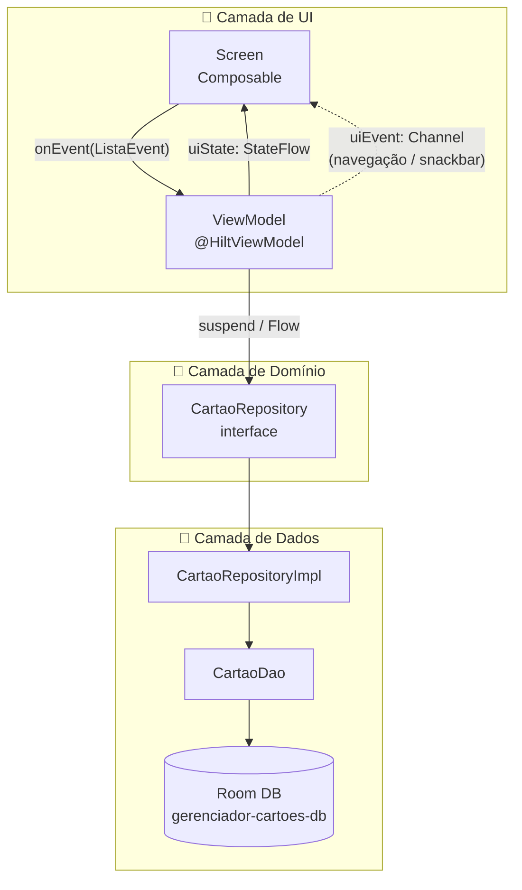

**🎨 Camada de UI** — tudo que o usuário vê e toca. Os composables (`Screen` e `Content`) exibem informações e enviam eventos para o ViewModel. Nunca contêm lógica de negócio.

**🎯 Camada de Domínio** — o contrato do app. O `Repository` é uma interface que define *o que* pode ser feito sem revelar *como*. O ViewModel depende apenas desta interface — ele não sabe se os dados vêm de um banco local, de uma API ou de qualquer outra fonte.

**💾 Camada de Dados** — onde os dados realmente vivem. O `RepositoryImpl` implementa o contrato, converte entre modelos (`Cartao` ↔ `CartaoEntity`) e delega ao `DAO` do Room.

### Como um clique do usuário vira uma mudança na tela

Vamos rastrear o que acontece quando o usuário toca o botão **"+"** (FAB) na tela de Lista para criar um novo cartão. Cada linha de código abaixo é real e está no projeto:

**Passo 1 — A tela captura o clique e emite um evento**

```kotlin
// ui/feature/lista/ListaScreen.kt
FloatingActionButton(
    onClick = { onEvent(ListaEvent.NavegaParaNovo) } // ← envia o evento para o ViewModel
) {
    Icon(Icons.Default.Add, contentDescription = "Novo cartão")
}
```

**Passo 2 — O ViewModel recebe e processa o evento**

```kotlin
// ui/viewmodel/ListaViewModel.kt
fun onEvent(event: ListaEvent) {
    when (event) {                                         // ← when exaustivo: todos os casos tratados
        ListaEvent.NavegaParaNovo ->
            viewModelScope.launch {
                _uiEvent.send(ListaUiEvent.NavegaParaNovo) // ← envia para o Channel
            }
        is ListaEvent.ExcluirCartao -> excluir(event.id)
        // ... outros eventos
    }
}
```

**Passo 3 — A tela coleta o evento do Channel e navega**

```kotlin
// ui/feature/lista/ListaScreen.kt
LaunchedEffect(viewModel) {
    viewModel.uiEvent.collect { event ->
        when (event) {
            ListaUiEvent.NavegaParaNovo      -> onNavigateToNovo()   // ← navega!
            is ListaUiEvent.NavegaParaItem   -> onNavigateToItem(event.id)
            is ListaUiEvent.MostrarErro      -> snackbarHostState.showSnackbar(event.mensagem)
            // ...
        }
    }
}
```

**Passo 4 — Quando um cartão é salvo, a lista atualiza automaticamente**

Quando o usuário salva um cartão, o Room atualiza o banco de dados. O `CartaoDao` retorna um `Flow` — um stream que emite uma nova lista sempre que o banco muda. O ViewModel observa esse Flow:

```kotlin
// ui/viewmodel/ListaViewModel.kt
private fun observarCartoes() {
    viewModelScope.launch {
        cartaoRepository.observarTodos().collect { lista ->
            _uiState.update { it.copy(cartoes = lista, carregando = false) }
        }
    }
}
```

A tela coleta o `StateFlow` e recompõe automaticamente — sem precisar "recarregar" nada manualmente:

```kotlin
// ui/feature/lista/ListaScreen.kt
val uiState by viewModel.uiState.collectAsStateWithLifecycle()
// A partir daqui, toda vez que _uiState mudar, a ListaContent redesenha sozinha
```

### Por que Channel para navegação e não StateFlow?

Esta é uma das decisões mais importantes da arquitetura. Imagine que usássemos `StateFlow` para enviar o evento de navegação:

```kotlin
// ❌ NÃO fazemos assim — problema com rotação de tela
_navegarParaNovo.value = true
```

Se o usuário **girar o celular** após navegar, o Android recria a tela. A nova tela coleta o `StateFlow` e vê o valor `true` — e navega novamente, sem o usuário ter pedido!

Com `Channel`, isso não acontece porque o Channel entrega cada mensagem **uma única vez** e descarta:

```kotlin
// ✅ Fazemos assim — evento é consumido uma só vez
private val _uiEvent = Channel<ListaUiEvent>(Channel.BUFFERED)
val uiEvent = _uiEvent.receiveAsFlow()

// No ViewModel: envia e esquece
_uiEvent.send(ListaUiEvent.NavegaParaNovo)

// Na tela: LaunchedEffect(viewModel) garante que o collector sobrevive
// a recomposições mas não redeliver eventos já consumidos
```

### Diagrama de dependências entre camadas

A regra mais importante da arquitetura é: **cada camada só conhece a camada imediatamente abaixo**, e nunca as de cima.

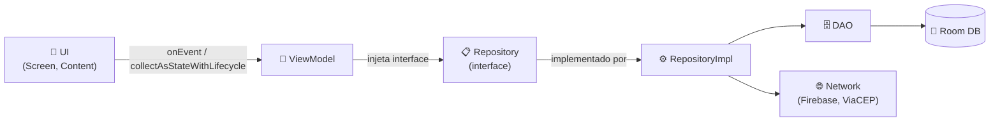

Violações proibidas — o compilador ou a revisão de código detectam:
- UI **nunca** acessa `CartaoDao` ou `CartaoEntity` diretamente
- ViewModel **nunca** importa o SDK do Firebase
- `CartaoRepository` (interface) **nunca** expõe `CartaoEntity` — só tipos de domínio como `Cartao`

**Princípios aplicados:**
- 🔒 **Separação de camadas** — UI nunca acessa `CartaoEntity` ou `CartaoDao` diretamente
- 🔄 **Reatividade** — `Flow<List<Cartao>>` do Room propaga mudanças automaticamente para a UI
- 🎯 **UDF** — estado imutável (`StateFlow`), mutação via `_uiState.update { it.copy(...) }`
- 📡 **Eventos one-shot** — navegação e Snackbar via `Channel<UiEvent>(BUFFERED)`, nunca `StateFlow`

---

## 🗂️ Estrutura do Projeto

```
app/src/main/java/com/app/gerenciadorcartoes/
│
├── GerenciadorCartoesApp.kt   ← @HiltAndroidApp — ponto de entrada do DI
├── MainActivity.kt            ← única Activity do app
│
├── model/          ← modelos de domínio puros (zero import de framework)
├── data/local/     ← banco de dados: entity/, dao/, database/, security/, session/
├── repository/     ← interfaces + implementações + mapper/
├── network/        ← auth/ (interface), firebase/ (impl), model/, service/
├── di/             ← módulos Hilt: AppModule, AuthModule, NetworkModule
│
└── ui/
    ├── theme/          ← Design System: cores, tipografia, espaçamentos, ícones
    ├── components/     ← composables reutilizáveis (AppScaffold, AppTopAppBar…)
    ├── navigation/     ← Routes.kt + AppNavHost.kt
    ├── feature/        ← uma pasta por tela (splash, login, lista, detalhe…)
    └── viewmodel/      ← todos os ViewModels (irmão de ui/, nunca dentro de feature/)
```

### O papel de cada camada

| Pacote | O que contém | Regra de ouro |
|---|---|---|
| `model/` | `Cartao`, `UsuarioAuth` etc. — data classes puras | Zero importações de framework; se o banco mudar, este pacote não muda |
| `data/local/` | `@Entity`, `@Dao`, `@Database`, criptografia de sessão | Nunca vaza `CartaoEntity` para fora deste pacote |
| `repository/` | Interfaces + `RepositoryImpl` + `mapper/` | Único lugar que converte `Entity ↔ Model`; o ViewModel injeta só a interface |
| `network/` | Interface de auth + implementação Firebase + DTO ViaCEP + clientes Retrofit | `FirebaseAuthDataSource` é a única classe que importa o SDK do Firebase |
| `di/` | Módulos Hilt | `abstract class` quando mistura `@Binds` e `@Provides`; `object` quando só `@Provides` |
| `ui/feature/<nome>/` | `XScreen`, `XContent`, `XEvent`, `XUiEvent`, `XUiState` | Nenhuma lógica de negócio; `hiltViewModel()` apenas no `XScreen` |
| `ui/viewmodel/` | Todos os `@HiltViewModel` | Fora de `ui/feature/` — irmão de `ui/`, não filho |

> **Sobre o prefixo `X`:** nos nomes acima, o `X` é um placeholder que representa o nome da feature. Na prática: `ListaScreen`, `ListaContent`, `ListaEvent`, `ListaUiEvent`, `ListaUiState` — ou `Detalhe...`, `CadastrarAlterar...` etc. É uma convenção de documentação para mostrar o padrão de forma genérica.

---

## 🔐 Segurança de Dados

A segurança foi pensada em camadas — cada tipo de dado sensível tem a sua proteção específica.

### Fluxo de autenticação e sessão

O diagrama abaixo mostra o que acontece quando o usuário faz login:

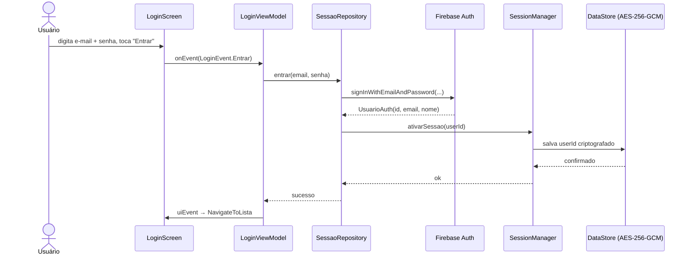

Na próxima abertura do app, a `SplashScreen` chama `SessaoRepository.verificarSessaoInicial()`, que lê o `userId` do DataStore criptografado. Se existir, o app navega direto para a Lista sem precisar de login novamente.

### Proteção de cada tipo de dado

| O que é protegido | Como é protegido |
|---|---|
| **Senha do usuário** | Gerenciada **exclusivamente pelo Firebase** — a senha nunca é salva no celular. O Firebase armazena apenas o hash nos servidores do Google. O campo `senha` foi removido do banco local na migration `v5→v6`. |
| **Sessão ativa** | O `userId` é salvo no DataStore com criptografia **AES-256-GCM** via Android Keystore. A chave criptográfica fica no hardware do celular e nunca sai dele. |
| **Tokens de autenticação** | Gerenciados pelo Firebase, que cuida da emissão, renovação e revogação automática. O app não gerencia tokens. |
| **Recuperação de senha** | Feita por **e-mail** pelo Firebase — o app nunca precisa conhecer a senha atual do usuário. |
| **Dados em trânsito** | Firebase usa HTTPS/TLS. A API ViaCEP também usa HTTPS. Nenhuma chamada de rede ocorre sem criptografia. |
| **Dados dos cartões** | Salvos localmente no celular e **nunca enviados a nenhum servidor externo**. |

> O app é **offline-first**: os cartões ficam salvos localmente no celular e nunca são enviados a nenhum servidor externo. Apenas o login/cadastro e a consulta de CEP requerem conexão com a internet.

---

## 📐 Padrões e Boas Práticas

Esta seção explica as decisões de arquitetura com foco em aprendizado.

| Padrão | O que é | Por que usamos |
|---|---|---|
| **MVVM** | Separa a tela (View) da lógica (ViewModel) e dos dados (Model) | A tela fica simples — só renderiza o que o ViewModel manda. A lógica fica testável sem precisar de um dispositivo. |
| **UDF — Fluxo Unidirecional** | Dados fluem em uma única direção: evento → ViewModel → estado → tela | Fica fácil saber o que causou cada mudança na tela. Zero surpresas com estado desatualizado. |
| **StateFlow** | Stream de estado que a tela observa em tempo real | A tela se atualiza automaticamente quando o estado muda — sem chamar nada manualmente. |
| **Channel para eventos pontuais** | Canal para mensagens que ocorrem uma única vez (navegar, Snackbar) | Se usássemos StateFlow para navegação, o app navegaria de novo ao girar o celular. O Channel entrega o evento uma vez e descarta. |
| **Hilt (injeção de dependência)** | O framework cria e entrega automaticamente as dependências de cada classe | Sem Hilt, teríamos que criar manualmente `Repository`, `DAO`, `Database` em cada ViewModel. Com Hilt, basta declarar o que precisa. |
| **Room com Flow** | Banco de dados local que emite atualizações automáticas | Quando um cartão é salvo, a lista já atualiza sozinha na tela — sem buscar os dados de novo manualmente. |
| **Sealed Interface para eventos** | Tipo que lista todas as ações possíveis de uma tela | O compilador obriga a tratar todos os casos no `when`. Se esquecer um evento, o build falha — o bug nunca chega ao usuário. |
| **Separação de camadas rígida** | UI nunca acessa banco direto; ViewModel nunca importa o SDK do Firebase | Cada camada pode ser trocada ou testada de forma independente. Ex: trocar Firebase por outro provedor de autenticação sem tocar em nenhum ViewModel. |
| **runCatching em vez de try/catch** | Captura exceções de forma funcional e idiomática em Kotlin | Torna o fluxo de erro explícito no `.onFailure { }` sem interromper o `.onSuccess { }`, reduzindo o risco de exceções silenciosas. |
| **Mapper isolado no Repository** | Conversão `Entity ↔ Model` acontece apenas em `repository/mapper/` | Garante que modelos de banco (`CartaoEntity`) nunca apareçam na UI ou no ViewModel — se o schema do banco mudar, apenas o mapper é atualizado. |

---

## 🚀 Como Executar

### Pré-requisitos

- **Android Studio Meerkat ou superior** com suporte a Kotlin K2
- **JDK 17** configurado no Android Studio (File → Project Structure → SDK Location → Gradle JDK → selecione JDK 17)
- **SDK Android 28+** instalado (SDK Manager)
- Arquivo `google-services.json` no diretório `app/` *(incluso no repositório)*

### Passo a passo

```bash
# 1. Clone o repositório
git clone https://github.com/seu-usuario/g3-bank.git
cd g3-bank

# 2. Abra no Android Studio
#    File → Open → selecione a pasta do projeto

# 3. Aguarde o Gradle sync terminar
#    (primeira vez pode levar alguns minutos — baixa todas as dependências)

# 4. Conecte um dispositivo físico ou inicie um emulador com Android 9+ (API 28+)

# 5. Execute o app
#    Menu Run → Run 'app'
#    ou Shift+F10 (Windows/Linux) / Ctrl+R (macOS)
```

> **Firebase:** o arquivo `google-services.json` já está incluído no repositório com um projeto Firebase de desenvolvimento. O app funciona sem nenhuma configuração adicional.

> **Offline:** os cartões são salvos localmente no celular. A única funcionalidade que exige internet é o login/cadastro (Firebase Authentication) e o preenchimento automático de CEP (ViaCEP).

### Solução de problemas comuns

| Problema | Sintoma | Solução |
|---|---|---|
| **Gradle sync falhou** | "Could not resolve dependency" | Verifique sua conexão com a internet e clique em "Sync Now" novamente |
| **SDK não encontrado** | "SDK location not found" | Android Studio: File → Project Structure → SDK Location → defina o caminho do Android SDK |
| **JDK incorreto** | "Unsupported class file major version" | File → Project Structure → SDK Location → Gradle JDK → selecione JDK 17 |
| **Hilt/KSP error** | "cannot find symbol @HiltViewModel" | Build → Clean Project → Rebuild Project para forçar regeneração do código KSP |
| **Firebase não inicializa** | "FirebaseApp is not initialized" | Confirme que `google-services.json` está em `app/` (não na raiz do projeto) |
| **Emulador não aparece** | Lista de dispositivos vazia | AVD Manager → crie um AVD com API 28 ou superior |
| **App trava na Splash** | Tela branca permanente | Verifique o Logcat — geralmente é erro de inicialização do Firebase ou do banco Room |

---

## 🌐 APIs Externas

O projeto consome a seguinte API externa:

### 📮 ViaCEP — Consulta de CEP

> API pública e gratuita do Brasil para consulta de endereços a partir do CEP.

| Campo | Valor |
|---|---|
| **Base URL** | `https://viacep.com.br/ws/` |
| **Autenticação** | Nenhuma |
| **Conversor** | kotlinx-serialization |
| **Timeout** | 30s |

**Endpoint:**

```
GET {cep}/json/
```

**Como o app usa:** quando o usuário digita um CEP no formulário de cadastro, o app chama esta API, recebe os campos de endereço e preenche automaticamente os campos `logradouro`, `bairro`, `localidade` e `uf`. Isso melhora a experiência do usuário e reduz erros de digitação de endereço.

**Campos consumidos pelo app:**

| Campo JSON | Tipo | Descrição |
|---|---|---|
| `logradouro` | `String` | Nome da rua / avenida |
| `bairro` | `String` | Bairro |
| `localidade` | `String` | Nome da cidade |
| `uf` | `String` | Sigla do estado (ex: `SP`, `RJ`) |

**Exemplo de chamada:**
```
GET https://viacep.com.br/ws/01310100/json/
```

**Exemplo de resposta:**
```json
{
  "logradouro": "Avenida Paulista",
  "bairro": "Bela Vista",
  "localidade": "São Paulo",
  "uf": "SP"
}
```

---

## 🎨 Design System

O app usa **Material Design 3** — o sistema visual oficial do Google para Android — com uma identidade personalizada G3 Bank baseada em azul profundo.

**Por que Material Design 3?** Porque ele já resolve automaticamente acessibilidade, espaçamentos corretos, comportamento de temas claro/escuro e animações — a equipe foca em produto, não em reinventar componentes visuais.

Todos os espaçamentos e tamanhos de ícone do app são definidos como **tokens** (valores nomeados), não como números fixos no código. Isso garante consistência em todas as telas e facilita ajustes globais.

| Token de cor | Light | Dark | Onde aparece |
|---|---|---|---|
| `primary` | `#0052CC` | `#ADC6FF` | Botões principais, FAB, círculo da marca |
| `primaryContainer` | `#D6E4FF` | `#003B8C` | Fundo da barra superior (TopAppBar) |
| `tertiary` | `#6750A4` | `#CDB4FF` | Destaques e labels de acento |
| `background` | `#F8FBFF` | `#001432` | Fundo geral das telas |

| Token de espaçamento | Valor | Uso típico |
|---|---|---|
| `extraSmall` | 4 dp | Separação mínima entre elementos |
| `small` | 8 dp | Espaçamento interno de chips e badges |
| `smallMedium` | 12 dp | Separação entre ícone e texto |
| `medium` | 16 dp | Padding padrão de telas e cards |
| `large` | 24 dp | Separação entre seções |
| `extraLarge` | 32 dp | Espaçamentos maiores e margens externas |

**Como usar os tokens no código:**

```kotlin
// ✅ SEMPRE assim — obtendo os tokens via CompositionLocal
@Composable
fun CartaoItem(cartao: Cartao, onEvent: (ListaEvent) -> Unit) {
    val spacing  = LocalSpacing.current    // acessa os tokens de espaçamento
    val iconSize = LocalIconSize.current   // acessa os tokens de tamanho de ícone

    Card(
        modifier = Modifier.padding(horizontal = spacing.medium) // 16dp
    ) {
        Row(
            modifier = Modifier.padding(spacing.small), // 8dp
            horizontalArrangement = Arrangement.spacedBy(spacing.smallMedium) // 12dp
        ) {
            Icon(
                modifier = Modifier.size(iconSize.medium) // 24dp
            )
            // ...
        }
    }
}

// ❌ NUNCA assim — valores literais no código de feature
Card(modifier = Modifier.padding(horizontal = 16.dp)) { ... }
```

---

## 🗄️ Banco de Dados

O app usa **Room** (SQLite) com duas tabelas principais. O banco está na versão **7**, com migrations explícitas preservando os dados do usuário a cada atualização do app.

> **Por que migrations?** Quando uma nova versão do app é publicada, os usuários já têm o banco instalado no celular. Sem migrations, o Room apagaria tudo e recriaria o banco — o usuário perderia todos os cartões cadastrados. Com migrations, apenas as alterações necessárias são aplicadas, mantendo os dados intactos.

### Diagrama de tabelas

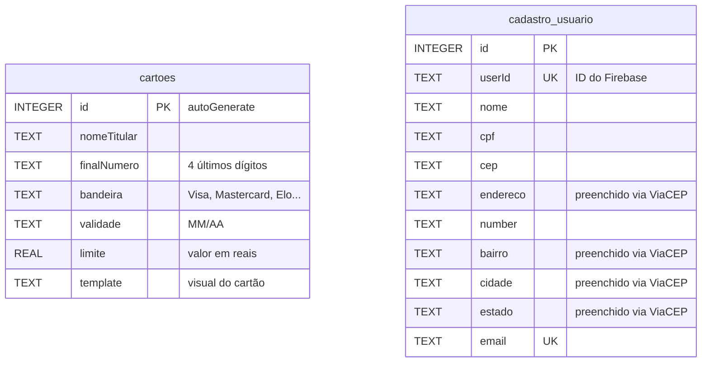

### Histórico de versões do banco

| Versão | O que mudou |
|---|---|
| v1 | Criação inicial das tabelas `cartoes` e `cadastro_usuario` |
| v2–v4 | Adição de campos de endereço (`cep`, `bairro`, `cidade`, `estado`) |
| v5 | Adição do campo `template` na tabela `cartoes` |
| v6 | **Remoção** do campo `senha` da tabela `cadastro_usuario` (a senha passou a ser gerenciada exclusivamente pelo Firebase) |
| v7 | Adição do campo `userId` na tabela `cadastro_usuario` para vincular o perfil local ao Firebase Auth |

**Tabela `cartoes`** — armazena os cartões de crédito/débito do usuário:

| Campo | Tipo | Descrição |
|---|---|---|
| `id` | `INTEGER` PK | Identificador único gerado automaticamente |
| `nomeTitular` | `TEXT` | Nome impresso no cartão |
| `finalNumero` | `TEXT` | Últimos 4 dígitos do cartão |
| `bandeira` | `TEXT` | Visa, Mastercard, Elo, etc. |
| `validade` | `TEXT` | Formato MM/AA |
| `limite` | `REAL` | Limite de crédito em reais |
| `template` | `TEXT` | Visual do card: `default`, `bradesco`, `itau`, `nubank`, `inter`, `c6bank` |

**Tabela `cadastro_usuario`** — armazena o perfil do usuário logado:

| Campo | Tipo | Descrição |
|---|---|---|
| `id` | `INTEGER` PK | Identificador local |
| `userId` | `TEXT` UNIQUE | ID do Firebase Authentication |
| `nome` | `TEXT` | Nome completo |
| `cpf` | `TEXT` | CPF formatado |
| `cep` | `TEXT` | CEP do endereço |
| `endereco` | `TEXT` | Rua / avenida (preenchido via ViaCEP) |
| `number` | `TEXT` | Número do endereço |
| `bairro` | `TEXT` | Bairro (preenchido via ViaCEP) |
| `cidade` | `TEXT` | Cidade (preenchida via ViaCEP) |
| `estado` | `TEXT` | UF (preenchido via ViaCEP) |
| `email` | `TEXT` UNIQUE | E-mail de login |

---

## ⚙️ Sincronização Offline (WorkManager)

O app segue um modelo *offline-first* para o cadastro de cartões. Resumo técnico do fluxo de sincronização:

- **Salvar offline**: ao salvar um cartão (`CartaoRepositoryImpl.salvar`) o app gera um `clientId` (UUID) para idempotência e persiste o registro localmente com `syncPending = true`.
- **Campos novos no schema**: `CartaoEntity` adiciona `clientId: String?` e `syncPending: Boolean` (0/1). As migrations do Room atualizam o esquema automaticamente.
- **Worker de sincronização**: `SyncPendingCardsWorker` (Hilt-enabled) consulta `cartaoRepository.buscarPendentes()` e chama `cartaoRepository.sincronizarCartao(cartao)` sequencialmente. Em sucesso, o repositório marca `syncPending = false`.
- **Hilt + WorkManager**: `GerenciadorCartoesApp` implementa `Configuration.Provider` e injeta `HiltWorkerFactory` (via `@HiltAndroidApp`) para permitir Workers com dependências injetadas.
- **Comportamento de debug**: durante investigação foi usado `ExistingWorkPolicy.REPLACE` para forçar reexecução do Worker; o código final usa `ExistingWorkPolicy.KEEP` — ver `SyncCoordinator`.
- **Logs**: logs de sincronização estão condicionados a `BuildConfig.DEBUG`. Para debug, observe Logcat nos tags: `SyncCoordinator`, `SyncPendingWorker`, `CartaoRepository`.

Como testar rapidamente:

1. Build e instale o APK:
```bash
./gradlew :app:assembleDebug
adb install -r app/build/outputs/apk/debug/app-debug.apk
```
2. Crie um cartão no app (sem rede se quiser testar offline). Verifique que `syncPending` está `1` no inspector do DB.
3. Forçar execução do sync (ou esperar agendamento): observe Logcat com filtros:
```bash
adb logcat -s SyncPendingWorker SyncCoordinator CartaoRepository
```
4. Após sincronização bem-sucedida, `syncPending` deverá virar `0`.

Notas de robustez:
- Tratar erros HTTP 4xx como finais (não retry) e 5xx/timeouts como transitórios (retry). Considere mapear exceções da camada `ApiService` no repositório para decisão de retry.
- Remova ou reduza logs verbosos antes do merge para produção se necessário.


## 📚 Documentação Técnica

Os documentos abaixo aprofundam aspectos específicos do projeto e são o ponto de partida para quem quiser contribuir ou estudar a arquitetura em detalhes:

| Documento | Descrição |
|---|---|
| [📖 DEVELOPMENT.md](docs/DEVELOPMENT.md) | Stack detalhada, arquitetura, padrões MVVM e guias de desenvolvimento |
| [🏛️ ARCHITECTURE.md](docs/ARCHITECTURE.md) | Decisões arquiteturais e diagramas |
| [📋 PROJECT_CONTEXT.md](docs/PROJECT_CONTEXT.md) | Contexto do projeto e requisitos |
| [✍️ CODING_GUIDELINES.md](docs/CODING_GUIDELINES.md) | Convenções de código e boas práticas |
| [🤖 AI_CONTEXT.md](docs/AI_CONTEXT.md) | Contexto para assistentes de IA |

---

## 📋 Requisitos Técnicos

| Requisito | Valor |
|---|---|
| **Min SDK** | API 28 (Android 9.0 Pie) |
| **Target SDK** | API 36 |
| **Compile SDK** | API 36 |
| **Java** | JDK 17 (compilação) |
| **Linguagem** | Kotlin 2.3.21 (compilador K2) |
| **Build System** | Gradle 9.x + AGP 9.2.1 |

---

## 📖 Glossário

Para quem está começando no desenvolvimento Android, esta tabela explica os termos técnicos usados neste README:

| Termo | Significado |
|---|---|
| **Activity** | Ponto de entrada de uma tela Android. No app, há apenas uma (`MainActivity`). Hoje as telas são gerenciadas pelo Compose + Navigation Compose, não por múltiplas Activities. |
| **BOM** (Bill of Materials) | Arquivo que centraliza as versões de um grupo de bibliotecas relacionadas. Ao declarar um BOM (ex: Firebase BOM), todas as dependências do grupo ficam em versões compatíveis entre si. |
| **Channel** | Primitiva de coroutines para comunicação entre produtor e consumidor. Diferente do `StateFlow`, o `Channel` entrega cada mensagem uma única vez e a descarta. Usado para eventos pontuais como navegação e Snackbars. |
| **Composable** | Função Kotlin marcada com `@Composable` que descreve um pedaço de UI. O Compose chama essas funções para "compor" a tela. |
| **Coroutines** | Mecanismo de Kotlin para executar código assíncrono (como chamadas de banco ou de rede) sem bloquear a thread principal da UI. Usadas com `suspend`, `launch`, `viewModelScope`. |
| **DAO** (Data Access Object) | Interface Kotlin com as operações de banco de dados. O Room gera a implementação automaticamente a partir das anotações (`@Query`, `@Insert`, `@Delete`). |
| **Entity** | Data class Kotlin marcada com `@Entity` que representa uma tabela no banco de dados Room. Cada campo se torna uma coluna. |
| **Flow** | Stream reativo de dados em Kotlin. Quando o banco de dados muda, o `Flow` emite automaticamente os novos dados para todos os coletores — como a UI. |
| **Hilt** | Framework de injeção de dependência para Android construído sobre o Dagger. Automatiza a criação e o ciclo de vida das dependências com anotações como `@HiltViewModel` e `@Inject`. |
| **KSP** (Kotlin Symbol Processing) | Ferramenta que processa anotações diretamente no código Kotlin em tempo de compilação (sem converter para Java). Usada pelo Hilt e Room para gerar código. Mais rápido que o KAPT. |
| **MVVM** (Model-View-ViewModel) | Padrão de arquitetura que separa dados (Model), UI (View) e lógica de apresentação (ViewModel). Facilita testes e mantém a tela simples. |
| **Recomposição** | Processo pelo qual o Compose redesenha apenas os Composables cujos dados mudaram. Ao atualizar o `StateFlow`, o Compose identifica quais partes da tela precisam ser redesenhadas e recompõe somente elas. |
| **Repository Pattern** | Padrão que cria uma camada de abstração entre o ViewModel e as fontes de dados (banco, API). O ViewModel fala com uma interface; a implementação concreta pode ser trocada sem impacto na UI. |
| **Room** | Biblioteca do Android que simplifica o acesso ao SQLite com validação de queries em tempo de compilação e suporte nativo a `Flow` e `suspend`. |
| **Sealed Interface** | Tipo Kotlin que define um conjunto fechado de subtipos. Usado para modelar todos os eventos possíveis de uma tela — o compilador obriga a tratar todos os casos no `when`. |
| **StateFlow** | Versão do `Flow` com um valor atual sempre disponível. A UI coleta o `StateFlow` e recompõe automaticamente ao receber um novo estado. Ideal para representar o estado da tela. |
| **UDF** (Unidirectional Data Flow) | Princípio onde os dados fluem em uma única direção: evento (UI) → processamento (ViewModel) → estado novo → renderização (UI). Elimina estados inconsistentes e facilita debugging. |
| **ViewModel** | Classe responsável por manter e processar o estado da tela. Sobrevive a rotações de tela (o Android destrói e recria a Activity, mas o ViewModel permanece). |

---

## 🔗 Aprenda Mais

Recursos oficiais para aprofundar os conceitos usados neste projeto:

| Tecnologia | Recurso | Descrição |
|---|---|---|
| **Kotlin** | [kotlinlang.org](https://kotlinlang.org/docs/home.html) | Documentação oficial da linguagem |
| **Jetpack Compose** | [developer.android.com/compose](https://developer.android.com/develop/ui/compose/documentation) | Guia oficial de UI com Compose |
| **MVVM + UDF** | [Guia de arquitetura Android](https://developer.android.com/topic/architecture) | Arquitetura recomendada pelo Google |
| **ViewModel** | [developer.android.com/topic/libraries/architecture/viewmodel](https://developer.android.com/topic/libraries/architecture/viewmodel) | Como usar ViewModel corretamente |
| **StateFlow / Flow** | [kotlinlang.org/docs/flow.html](https://kotlinlang.org/docs/flow.html) | Fluxos reativos em Kotlin |
| **Room** | [developer.android.com/training/data-storage/room](https://developer.android.com/training/data-storage/room) | Banco de dados local com Room |
| **Hilt** | [dagger.dev/hilt](https://dagger.dev/hilt/) | Injeção de dependência com Hilt |
| **Navigation Compose** | [developer.android.com/guide/navigation/design](https://developer.android.com/guide/navigation/design) | Navegação type-safe com Compose |
| **Firebase Auth** | [firebase.google.com/docs/auth/android](https://firebase.google.com/docs/auth/android/start) | Autenticação com Firebase |
| **Material Design 3** | [m3.material.io](https://m3.material.io) | Sistema de design do Google |
| **Coroutines** | [developer.android.com/kotlin/coroutines](https://developer.android.com/kotlin/coroutines) | Programação assíncrona com Kotlin |
| **DataStore** | [developer.android.com/topic/libraries/architecture/datastore](https://developer.android.com/topic/libraries/architecture/datastore) | Armazenamento de preferências moderno |
| **Android Keystore** | [developer.android.com/training/articles/keystore](https://developer.android.com/training/articles/keystore) | Criptografia com hardware do celular |

---

## 📄 Licença

```
MIT License — Copyright (c) 2026 G3 Bank
```

---

<p align="center">
  Feito com ❤️ usando Kotlin e Jetpack Compose
</p>
