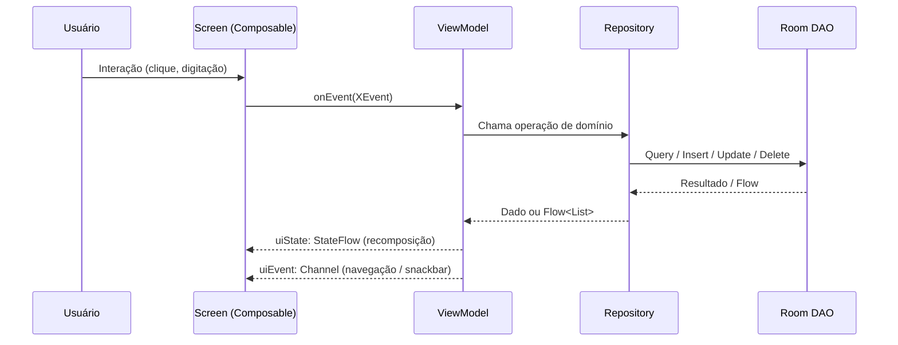
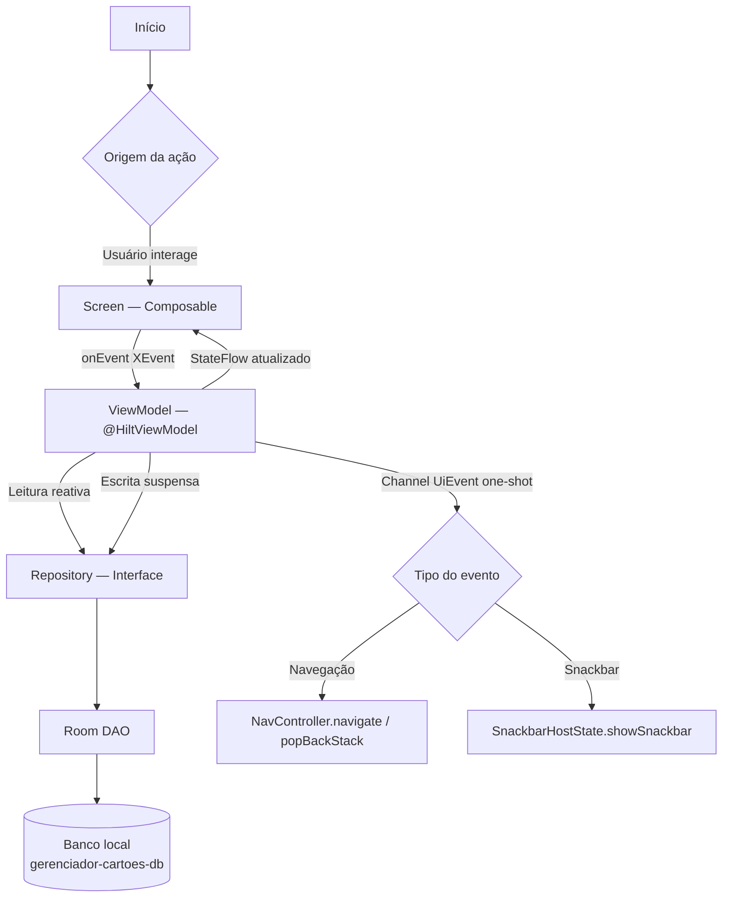
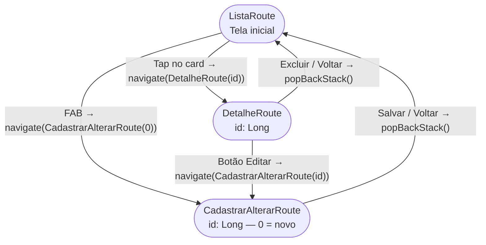

# GerenciadorCartoes

Aplicativo Android que demonstra **CRUD completo** de cartões usando arquitetura **MVVM** estrita com Hilt, Room, Retrofit e Navigation Compose 2 type-safe.

---

## Stack

### Versões

| Tecnologia              | Versão     | Grupo / Artefato                                          |
|-------------------------|------------|-----------------------------------------------------------|
| Kotlin                  | 2.3.21     | `org.jetbrains.kotlin`                                    |
| AGP                     | 9.0.0      | `com.android.tools.build:gradle`                          |
| KSP                     | 2.3.6      | `com.google.devtools.ksp`                                 |
| Compose BOM             | 2026.05.00 | `androidx.compose:compose-bom`                            |
| Navigation Compose      | 2.9.0      | `androidx.navigation:navigation-compose`                  |
| Hilt                    | 2.59.2     | `com.google.dagger:hilt-android`                          |
| Hilt Navigation Compose | 1.2.0      | `androidx.hilt:hilt-navigation-compose`                   |
| Room                    | 2.8.4      | `androidx.room:room-runtime`                              |
| Retrofit                | 3.0.0      | `com.squareup.retrofit2:retrofit`                         |
| OkHttp                  | 5.3.2      | `com.squareup.okhttp3:logging-interceptor`                |
| kotlinx-serialization   | 1.11.0     | `org.jetbrains.kotlinx:kotlinx-serialization-json`        |
| Serialization Converter | 1.0.0      | `com.jakewharton.retrofit:retrofit2-kotlinx-serialization-converter` |

---

## Branding de inicialização

- Splash Screen customizada com API oficial Android (`Theme.SplashScreen` + `installSplashScreen()` em `MainActivity`).

---

#### 🔧 KSP — Kotlin Symbol Processing
`com.google.devtools.ksp` · v2.3.6

Processador de código em tempo de compilação que **substitui o KAPT** (Kotlin Annotation Processing Tool). Gera o código boilerplate das anotações do Hilt e do Room sem precisar compilar em Java.

**Por que usar:**
- até 2× mais rápido que KAPT em builds incrementais
- compatível com Kotlin 2.x e com o compilador K2
- obrigatório para Hilt e Room nas versões atuais

**Como aparece no projeto:**
```kotlin
// app/build.gradle.kts
plugins {
    alias(libs.plugins.ksp)           // ativa o processador
}
dependencies {
    ksp(libs.hilt.compiler)           // gera código do Hilt
    ksp(libs.androidx.room.compiler)  // gera implementações do DAO
}
```

---

#### 💉 Hilt — Dagger Hilt
`com.google.dagger:hilt-android` · v2.59.2

Framework de **injeção de dependência** construído sobre o Dagger. Elimina o boilerplate de criar e passar dependências manualmente entre classes.

**Por que usar:**
- escapa completamente de instanciação manual de repositórios, DAOs e ViewModels
- integração nativa com `ViewModel`, `Activity`, `Fragment` e `WorkManager`
- escopo de ciclo de vida gerenciado automaticamente (`@Singleton`, `@ViewModelScoped`)

**Anotações principais usadas no projeto:**

| Anotação | Onde | O que faz |
|----------|------|-----------|
| `@HiltAndroidApp` | `GerenciadorCartoesApp` | Inicializa o grafo de DI na Application |
| `@AndroidEntryPoint` | `MainActivity` | Permite injeção na Activity |
| `@HiltViewModel` | ViewModels | Permite injeção de dependências no ViewModel |
| `@Inject constructor` | Impl classes | Marca o construtor que o Hilt deve usar |
| `@Binds` | `AppModule` | Vincula a interface `CartaoRepository` → `CartaoRepositoryImpl` |
| `@Provides` | `AppModule` | Cria instâncias de tipos externos (Room, Retrofit) |
| `@Singleton` | Módulos | Garante uma única instância por Application |

```kotlin
// Exemplo: ViewModel com dependência injetada pelo Hilt
@HiltViewModel
class ListaViewModel @Inject constructor(
    private val cartaoRepository: CartaoRepository, // injetado automaticamente
) : ViewModel()
```

---

#### 🔗 Hilt Navigation Compose
`androidx.hilt:hilt-navigation-compose` · v1.2.0

Integração entre Hilt e Navigation Compose. Permite usar `hiltViewModel()` dentro de `composable<T> {}` com escopo correto ao destino de navegação.

**Por que usar:**
- sem esta lib, `hiltViewModel()` não funciona dentro de `NavHost`
- garante que cada destino de navegação receba sua própria instância do ViewModel
- o ViewModel é destruído automaticamente ao sair do destino

```kotlin
// DetalheScreen.kt
@Composable
fun DetalheScreen(
    navigateBack : () -> Unit,
    viewModel    : DetalheViewModel = hiltViewModel(), // requer hilt-navigation-compose
)
```

---

#### 🗄️ Room
`androidx.room:room-runtime` + `room-ktx` · v2.8.4

Camada de abstração sobre o **SQLite** que mapeia classes Kotlin para tabelas e gera implementações de queries em tempo de compilação via KSP.

**Por que usar:**
- elimina SQL manual e `Cursor` — queries são validadas em tempo de compilação
- suporte nativo a `Flow<List<T>>` para leitura reativa (a UI atualiza sozinha ao salvar/deletar)
- `suspend fun` para operações de escrita, integrado com coroutines

**Componentes usados no projeto:**

| Anotação/Tipo | Arquivo | Função |
|---------------|---------|--------|
| `@Entity` | `CartaoEntity` | Mapeia a classe para a tabela `cartoes` |
| `@PrimaryKey(autoGenerate)` | `CartaoEntity` | Chave primária auto-incrementada |
| `@Dao` | `CartaoDao` | Interface com as queries da tabela |
| `@Query` | `CartaoDao` | SQL inline validado em compile-time |
| `@Insert` / `@Update` | `CartaoDao` | Operações de escrita |
| `@Database` | `AppDatabase` | Declara o banco e os DAOs disponíveis |
| `Flow<List<T>>` | `CartaoDao` | Leitura reativa — UI recompõe ao mudar dados |

```kotlin
// Leitura reativa: a ListaScreen atualiza automaticamente ao salvar/deletar
@Query("SELECT * FROM cartoes ORDER BY nomeTitular ASC")
fun observarTodos(): Flow<List<CartaoEntity>>

// Leitura reativa de item único: DetalheScreen atualiza após edição
@Query("SELECT * FROM cartoes WHERE id = :id")
fun observarPorId(id: Long): Flow<CartaoEntity?>
```

---

#### 🌐 Retrofit
`com.squareup.retrofit2:retrofit` · v3.0.0

Cliente HTTP type-safe para **consumo de APIs REST**. Transforma interfaces Kotlin com anotações em chamadas HTTP reais.

**Por que usar:**
- declaração de endpoints como funções `suspend` — integração nativa com coroutines
- sem código boilerplate de `HttpURLConnection` ou `OkHttpClient` manual
- suporte a conversores de serialização (JSON → data class automaticamente)

**Status no projeto:** a infraestrutura (Retrofit + OkHttp + ApiService) está provisionada e pronta em `NetworkModule`. Os endpoints serão adicionados em `ApiService` conforme necessidade.

```kotlin
// Exemplo do que será adicionado em ApiService quando integrar com API real
interface ApiService {
    @GET("cartoes")
    suspend fun listarCartoes(): List<CartaoResponse>

    @POST("cartoes")
    suspend fun criarCartao(@Body body: CartaoRequest): CartaoResponse
}
```

---

#### 🔍 OkHttp Logging Interceptor
`com.squareup.okhttp3:logging-interceptor` · v5.3.2

Interceptor do OkHttp que **loga todas as requisições e respostas HTTP** no Logcat em modo debug.

**Por que usar:**
- indispensável durante desenvolvimento para depurar chamadas de API
- mostra headers, body, status code e tempo de resposta
- configurado apenas em `NetworkModule` — não exposto em código de produção

```kotlin
// NetworkModule.kt
OkHttpClient.Builder()
    .addInterceptor(
        HttpLoggingInterceptor().apply {
            level = HttpLoggingInterceptor.Level.BODY // loga tudo em debug
        }
    )
    .build()
```

---

#### 📦 kotlinx-serialization
`org.jetbrains.kotlinx:kotlinx-serialization-json` · v1.11.0

Biblioteca oficial Kotlin para **serialização/desserialização JSON**. Usada em dois contextos distintos no projeto.

**Por que usar:**
- integração nativa com Kotlin (sem reflexão em runtime)
- suporte a `data class` com `@Serializable` sem configuração extra
- **obrigatório** para rotas type-safe do Navigation Compose 2

**Dois usos no projeto:**

| Uso | Como | Onde |
|-----|------|------|
| Rotas de navegação type-safe | `@Serializable` nas data classes de rota | `Routes.kt` |
| Desserialização de respostas HTTP | `json.asConverterFactory()` no Retrofit | `NetworkModule.kt` |

```kotlin
// Uso 1 — rotas type-safe (Navigation Compose 2 exige @Serializable)
@Serializable
data class DetalheRoute(val id: Long)

// Uso 2 — conversor de JSON para Retrofit
Retrofit.Builder()
    .addConverterFactory(json.asConverterFactory("application/json".toMediaType()))
```

---

#### 🔄 retrofit2-kotlinx-serialization-converter
`com.jakewharton.retrofit:retrofit2-kotlinx-serialization-converter` · v1.0.0

Adaptador que conecta o **Retrofit** à **kotlinx-serialization**, substituindo o Gson ou Moshi como conversor de JSON.

**Por que usar:**
- evita adicionar Gson ou Moshi (desnecessários se já usa kotlinx-serialization)
- usa a mesma serialização das rotas de navegação — zero duplicação de dependências
- desserialização sem reflexão → melhor performance

```kotlin
// NetworkModule.kt — registra o conversor no builder do Retrofit
.addConverterFactory(json.asConverterFactory("application/json".toMediaType()))
```

---

#### 🧭 Navigation Compose 2 (type-safe)
`androidx.navigation:navigation-compose` · v2.9.0

Sistema de navegação entre Composables com **rotas type-safe**. Elimina strings mágicas e erros de tipo em parâmetros de navegação.

**Por que usar (vs strings):**
- rotas são `@Serializable data class` — os parâmetros são verificados pelo compilador
- `SavedStateHandle.toRoute<T>()` extrai os parâmetros com tipo correto no ViewModel
- sem `NavKey` (Navigation 3) — API estável e amplamente documentada

```kotlin
// Navegação type-safe — sem strings, com verificação de tipo em compile-time
navController.navigate(DetalheRoute(id = cartao.id))   // ✅ compila

// No ViewModel — extrai parâmetros com tipo correto
private val route: DetalheRoute = savedStateHandle.toRoute()
private val id: Long = route.id
```

---

#### 🔴 Lifecycle ViewModel Compose + Runtime Compose
`androidx.lifecycle:lifecycle-viewmodel-compose` · v2.10.0
`androidx.lifecycle:lifecycle-runtime-compose` · v2.10.0

Extensões do Lifecycle para integração com **Jetpack Compose**.

| Artefato | O que fornece | Onde é usado |
|----------|--------------|--------------|
| `lifecycle-viewmodel-compose` | `hiltViewModel()` (junto com hilt-navigation-compose) | Todas as Screens |
| `lifecycle-runtime-compose` | `collectAsStateWithLifecycle()` | Todas as Screens |

**Por que `collectAsStateWithLifecycle()` em vez de `collectAsState()`:**
- respeita o ciclo de vida da Activity/Fragment — **para de coletar** quando a tela vai para background
- evita updates desnecessários e consumo de bateria em segundo plano

```kotlin
// ListaScreen.kt — coleta o StateFlow respeitando o ciclo de vida
val uiState by viewModel.uiState.collectAsStateWithLifecycle()
```

---

## Arquitetura

### Diagrama de sequência — fluxo de evento



### Diagrama de camadas — visão geral



---

## Navegação

### Diagrama



### Rotas (Navigation Compose 2 — type-safe)

```kotlin
@Serializable object ListaRoute
@Serializable data class DetalheRoute(val id: Long)
@Serializable data class CadastrarAlterarRoute(val id: Long = 0L) // 0 = cadastrar, >0 = editar
```

---

## Estrutura de Pacotes

```
com.app.gerenciadorcartoes/
│
├── GerenciadorCartoesApp.kt     → @HiltAndroidApp
├── MainActivity.kt              → @AndroidEntryPoint + setContent
│
├── model/
│   └── Cartao.kt                → Modelo de domínio
│
├── data/local/
│   ├── dao/CartaoDao.kt         → Queries Room (@Dao)
│   ├── database/AppDatabase.kt  → @Database
│   └── entity/CartaoEntity.kt   → @Entity Room
│
├── repository/
│   ├── CartaoRepository.kt      → Interface de domínio
│   ├── CartaoRepositoryImpl.kt  → Implementação Room
│   └── mapper/CartaoMapper.kt   → CartaoEntity ↔ Cartao
│
├── network/
│   └── service/ApiService.kt    → Interface Retrofit (endpoints futuros)
│
├── di/
│   ├── AppModule.kt             → Room + CartaoRepository
│   └── NetworkModule.kt         → Retrofit + OkHttp + ApiService
│
└── ui/
    ├── theme/                   → Color, Theme, Type, Shape, Spacing, IconSize
    ├── components/              → AppScaffold, AppTopAppBar, AppLoading, EmptyState
    ├── navigation/              → Routes.kt + AppNavHost.kt
    ├── feature/
    │   ├── lista/               → Screen, Event, UiEvent, state/UiState
    │   ├── detalhe/             → Screen, Event, UiEvent, state/UiState
    │   └── cadastraralterar/    → Screen, Event, UiEvent, state/UiState
    └── viewmodel/               → ListaViewModel, DetalheViewModel, CadastrarAlterarViewModel
```

---

## Guia de Camadas — O que colocar em cada pacote

> **Regra de ouro:** cada camada conhece somente as camadas abaixo dela. A UI nunca importa `CartaoEntity` nem `CartaoDao` — ela trabalha apenas com `Cartao` (modelo de domínio).

---

### `model/`

**Propósito:** modelo de domínio puro — representa o conceito de negócio sem acoplamento a Room, Retrofit ou Android.

| ✅ Coloque aqui | ❌ Nunca coloque aqui |
|---|---|
| `data class` com campos de negócio e defaults | Anotações `@Entity`, `@SerialName`, `@Json` |
| Campos com nomes em português/domínio | Imports de `androidx.*` ou `retrofit2.*` |
| Valores padrão em todos os campos (facilita `UiState`) | Lógica de validação ou transformação |

```kotlin
// ✅ correto
data class Cartao(
    val id          : Long   = 0L,
    val nomeTitular : String = "",
    val limite      : Double = 0.0,
)

// ❌ errado — Entity no domínio
@Entity data class Cartao(...)
```

---

### `data/local/entity/`

**Propósito:** representação do registro no banco SQLite. Mapeado 1-para-1 com uma tabela Room.

| ✅ Coloque aqui | ❌ Nunca coloque aqui |
|---|---|
| `@Entity data class` com as colunas da tabela | Lógica de negócio ou validação |
| `@PrimaryKey(autoGenerate = true)` | Referência ao modelo de domínio |
| `@ColumnInfo(name = "nome_coluna")` quando necessário | Campos não persistidos (`@Ignore` com cautela) |
| `@TypeConverters` para tipos não primitivos | Imports da camada UI |

```kotlin
@Entity(tableName = "cartoes")
data class CartaoEntity(
    @PrimaryKey(autoGenerate = true) val id: Long = 0L,
    val nomeTitular : String,
    val limite      : Double,
)
```

> **Nota:** o arquivo deve ter o mesmo nome da classe — `CartaoEntity.kt`, não `ItemEntity.kt`.

---

### `data/local/dao/`

**Propósito:** interface de acesso ao banco. Só contém queries SQL e operações Room.

| ✅ Coloque aqui | ❌ Nunca coloque aqui |
|---|---|
| `@Query`, `@Insert`, `@Update`, `@Delete` | Lógica de negócio ou mapeamento |
| `Flow<List<XEntity>>` para leitura reativa | Referência ao modelo de domínio |
| `suspend` para escrita (insert, update, delete) | Tratamento de erros ou try/catch |
| Queries ordenadas (ORDER BY) | Imports da camada UI |

```kotlin
@Dao
interface CartaoDao {
    @Query("SELECT * FROM cartoes ORDER BY nomeTitular ASC")
    fun observarTodos(): Flow<List<CartaoEntity>>   // reativo — sem suspend

    @Insert(onConflict = OnConflictStrategy.REPLACE)
    suspend fun inserir(entity: CartaoEntity): Long  // escrita — suspend
}
```

---

### `data/local/database/`

**Propósito:** único arquivo que declara o `RoomDatabase` e expõe os DAOs.

| ✅ Coloque aqui | ❌ Nunca coloque aqui |
|---|---|
| `@Database(entities = [...], version = N)` | Queries SQL |
| `abstract fun xDao(): XDao` para cada DAO | Lógica de migração fora de `Migration` |
| `addMigrations(...)` no `AppModule` ao evoluir o schema | Mais de um banco por arquivo |

```kotlin
@Database(entities = [CartaoEntity::class], version = 1, exportSchema = false)
abstract class AppDatabase : RoomDatabase() {
    abstract fun cartaoDao(): CartaoDao
}
```

> **Ao incrementar `version`**, sempre forneça uma `Migration` no `AppModule` para não perder dados do usuário.

---

### `repository/`

**Propósito:** interface de domínio (`CartaoRepository`) + implementação concreta (`CartaoRepositoryImpl`). Isola a UI do Room/Retrofit.

| ✅ Coloque aqui | ❌ Nunca coloque aqui |
|---|---|
| Interface com termos de negócio (`observarTodos`, `salvar`) | Anotações Room ou Retrofit |
| Implementação injeta DAO e chama mapper | Lógica de apresentação ou formatação |
| `Flow<List<Dominio>>` na interface (não `Flow<List<Entity>>`) | Dependências de `Context` ou Android |
| Tratamento de exceções de infraestrutura | Referências à camada UI |

```kotlin
// Interface — define o contrato (domínio não conhece Room)
interface CartaoRepository {
    fun observarTodos(): Flow<List<Cartao>>
    suspend fun salvar(cartao: Cartao): Long
}

// Implementação — única classe que conhece o DAO
class CartaoRepositoryImpl @Inject constructor(
    private val dao: CartaoDao,
) : CartaoRepository {
    override fun observarTodos() = dao.observarTodos().map { it.map(CartaoEntity::toDomain) }
    override suspend fun salvar(cartao: Cartao) = dao.inserir(cartao.toEntity())
}
```

---

### `repository/mapper/`

**Propósito:** converter entre `CartaoEntity` (Room) e `Cartao` (domínio) sem misturar lógica de negócio.

| ✅ Coloque aqui | ❌ Nunca coloque aqui |
|---|---|
| Funções de extensão `fun Entity.toDomain()` | Validações ou regras de negócio |
| Funções de extensão `fun Domain.toEntity()` | Mapeamento para DTO de rede |
| Um arquivo de mapper por entidade | Estado UI ou lógica de formatação |

```kotlin
fun CartaoEntity.toDomain(): Cartao = Cartao(id = id, nomeTitular = nomeTitular, ...)
fun Cartao.toEntity(): CartaoEntity = CartaoEntity(id = id, nomeTitular = nomeTitular, ...)
```

---

### `network/service/`

**Propósito:** interfaces Retrofit com os endpoints da API. Análogo ao DAO, mas para HTTP.

| ✅ Coloque aqui | ❌ Nunca coloque aqui |
|---|---|
| `interface XService` com `@GET`, `@POST`, `@PUT`, `@DELETE` | Lógica de retry ou autenticação (vai no `OkHttpClient`) |
| `suspend fun` que retorna DTO de rede | Mapeamento para modelo de domínio |
| DTOs de request/response como `data class` (com `@Serializable`) | Referência ao domínio ou Room |

```kotlin
interface CartaoService {
    @GET("cartoes")
    suspend fun listar(): List<CartaoResponse>

    @POST("cartoes")
    suspend fun criar(@Body body: CartaoRequest): CartaoResponse
}
```

---

### `di/`

**Propósito:** módulos Hilt que constroem e vinculam dependências. Dois módulos por padrão:

| Módulo | O que fornece |
|--------|---------------|
| `AppModule` | `AppDatabase`, DAOs, `@Binds` de repositórios locais |
| `NetworkModule` | `OkHttpClient`, `Retrofit`, `ApiService`, `@Binds` de repositórios de rede |

| ✅ Coloque aqui | ❌ Nunca coloque aqui |
|---|---|
| `@Provides` para tipos externos (Room, Retrofit) | Lógica de negócio |
| `@Binds` para vincular interface → implementação | Referências à camada UI |
| `@Singleton` para dependências com estado (DB, Retrofit) | Criação manual de objetos (use `@Provides`) |
| `abstract class` com `companion object` quando mistura `@Binds` + `@Provides` | Múltiplos módulos para o mesmo escopo sem necessidade |

```kotlin
@Module @InstallIn(SingletonComponent::class)
abstract class AppModule {

    @Binds @Singleton
    abstract fun bindCartaoRepository(impl: CartaoRepositoryImpl): CartaoRepository

    companion object {
        @Provides @Singleton
        fun provideDatabase(@ApplicationContext ctx: Context): AppDatabase =
            Room.databaseBuilder(ctx, AppDatabase::class.java, "gerenciador-cartoes-db").build()

        @Provides @Singleton
        fun provideCartaoDao(db: AppDatabase): CartaoDao = db.cartaoDao()
    }
}
```

---

### `ui/theme/`

**Propósito:** design system do app — tokens de cor, tipografia, forma, espaçamento e tamanho de ícone.

| Arquivo | O que define |
|---------|-------------|
| `Color.kt` | Constantes de cor (`Purple40`, `Pink80`, …) |
| `Theme.kt` | `GerenciadorCartoesTheme` — ponto de entrada; expõe `CompositionLocalProvider` |
| `Type.kt` | Escala tipográfica `Typography` — `displayLarge` → `labelSmall` |
| `Shape.kt` | Escala de formas `Shapes` — `small`, `medium`, `large` |
| `Spacing.kt` | Tokens de espaçamento `Spacing` via `LocalSpacing` (4dp, 8dp, 12dp, 16dp, 24dp, 32dp) |
| `IconSize.kt` | Tokens de tamanho de ícone `IconSize` via `LocalIconSize` (16dp, 20dp, 24dp, 40dp, 48dp) |

```kotlin
// ✅ uso correto nos Composables
val spacing = LocalSpacing.current
Modifier.padding(spacing.medium)          // 16dp

val iconSize = LocalIconSize.current
Modifier.size(iconSize.medium)            // 24dp

// ou via MaterialTheme (alternativa)
MaterialTheme.spacing.large               // 24dp
MaterialTheme.iconSize.small              // 20dp
```

---

### `ui/components/`

**Propósito:** composables reutilizáveis agnósticos a feature. Nunca recebem ViewModel.

| ✅ Coloque aqui | ❌ Nunca coloque aqui |
|---|---|
| Componentes usados em 2+ features | Composables específicos de uma só tela |
| `AppScaffold`, `AppTopAppBar`, `AppLoading`, `EmptyState` | Chamadas a `hiltViewModel()` |
| Parâmetros genéricos (lambdas, strings, estados primitivos) | Referências a `UiState` ou `Event` específicos |

```kotlin
// ✅ componente reutilizável — aceita qualquer conteúdo via slot
@Composable
fun AppScaffold(
    topBar               : @Composable () -> Unit = {},
    floatingActionButton : @Composable () -> Unit = {},
    content              : @Composable (PaddingValues) -> Unit,
)
```

---

### `ui/feature/<nome>/`

**Propósito:** tudo que é específico a uma feature (tela). Cada feature é auto-contida.

#### Estrutura obrigatória (5 arquivos)

```
ui/feature/lista/
├── ListaEvent.kt          → sealed interface — intenções do usuário
├── ListaUiEvent.kt        → sealed interface — eventos one-shot (navegação, snackbar)
├── ListaScreen.kt         → ListaScreen + ListaContent + @Preview
└── state/
    └── ListaUiState.kt    → data class imutável — estado visual completo
```

> O ViewModel fica em `viewmodel/` (veja abaixo).

#### `XEvent.kt` — o que o usuário pode fazer

```kotlin
sealed interface ListaEvent {
    data object NavegaParaNovo          : ListaEvent  // FAB pressionado
    data class  NavegaParaItem(val id: Long) : ListaEvent  // item tocado
    data class  ExcluirCartao(val id: Long)  : ListaEvent  // exclusão confirmada
}
```

#### `XUiEvent.kt` — saídas one-shot do ViewModel

```kotlin
sealed interface ListaUiEvent {
    data object NavegaParaNovo                     : ListaUiEvent  // navega
    data class  NavegaParaItem(val id: Long)       : ListaUiEvent  // navega
    data class  MostrarErro(val mensagem: String)  : ListaUiEvent  // snackbar
}
```

#### `state/XUiState.kt` — estado visual completo

```kotlin
data class ListaUiState(
    val cartoes    : List<Cartao> = emptyList(),
    val carregando : Boolean      = false,
    val erro       : String?      = null,
)
```

#### `XScreen.kt` — padrão Screen / Content / Preview

```kotlin
// Screen — coleta ViewModel, roteia UiEvent (LaunchedEffect), passa estado para Content
@Composable
fun ListaScreen(
    onNavigateToNovo : () -> Unit,
    viewModel        : ListaViewModel = hiltViewModel(),
) {
    val uiState by viewModel.uiState.collectAsStateWithLifecycle()

    LaunchedEffect(viewModel) {
        viewModel.uiEvent.collect { event ->
            when (event) {
                ListaUiEvent.NavegaParaNovo       -> onNavigateToNovo()
                is ListaUiEvent.NavegaParaItem    -> { /* navegar */ }
                is ListaUiEvent.MostrarErro       -> { /* snackbar */ }
            }
        }
    }

    ListaContent(uiState = uiState, onEvent = viewModel::onEvent)
}

// Content — puro; testável sem ViewModel; recebe estado + callback
@Composable
fun ListaContent(
    uiState : ListaUiState = ListaUiState(),
    onEvent : (ListaEvent) -> Unit = {},
) { /* renderiza uiState */ }

// Previews — chamam sempre Content, nunca Screen
@Preview @Composable
private fun ListaVaziaPreview() {
    GerenciadorCartoesTheme { ListaContent() }
}
@Preview @Composable
private fun ListaComItensPreview() {
    GerenciadorCartoesTheme { ListaContent(uiState = ListaUiState(cartoes = listOf(/* ... */))) }
}
```

---

### `viewmodel/`

**Propósito:** ViewModels de todas as features. Centralizados para facilitar navegação no projeto.

| ✅ Coloque aqui | ❌ Nunca coloque aqui |
|---|---|
| `@HiltViewModel class XViewModel` | Referências a `Context` ou `Activity` |
| `private val _uiState = MutableStateFlow(XUiState())` | Lógica de UI (formatação, visibilidade) |
| `private val _uiEvent = Channel<XUiEvent>(BUFFERED)` | Imports de Composables |
| Chamar o Repository nos coroutines (`viewModelScope.launch`) | Acesso a `Room` ou `Retrofit` diretamente |
| Tratar erros com `runCatching { }.onFailure { }` | Estado mutável exposto publicamente |

```kotlin
@HiltViewModel
class ListaViewModel @Inject constructor(
    private val cartaoRepository: CartaoRepository,
) : ViewModel() {

    private val _uiState = MutableStateFlow(ListaUiState(carregando = true))
    val uiState: StateFlow<ListaUiState> = _uiState.asStateFlow()

    private val _uiEvent = Channel<ListaUiEvent>(Channel.BUFFERED)
    val uiEvent = _uiEvent.receiveAsFlow()

    init { observarCartoes() }

    fun onEvent(event: ListaEvent) {
        when (event) {
            is ListaEvent.ExcluirCartao -> excluir(event.id)
            // ...
        }
    }

    private fun observarCartoes() {
        viewModelScope.launch {
            runCatching {
                cartaoRepository.observarTodos().collect { cartoes ->
                    _uiState.update { it.copy(cartoes = cartoes, carregando = false) }
                }
            }.onFailure { erro ->
                _uiEvent.send(ListaUiEvent.MostrarErro(erro.message ?: "Erro desconhecido"))
            }
        }
    }
}
```

---

### `ui/navigation/`

**Propósito:** rotas e grafo de navegação do app.

| Arquivo | O que contém |
|---------|-------------|
| `Routes.kt` | Objetos/classes `@Serializable` que identificam cada destino |
| `AppNavHost.kt` | Função `AppNavHost()` com `NavHost { composable<T> {} }` para cada rota |

```kotlin
// Routes.kt — um objeto/classe por destino
@Serializable object ListaRoute
@Serializable data class DetalheRoute(val id: Long)
@Serializable data class CadastrarAlterarRoute(val id: Long = 0L)

// AppNavHost.kt — registra os destinos
NavHost(navController, startDestination = ListaRoute) {
    composable<ListaRoute> {
        ListaScreen(
            onNavigateToItem = { id -> navController.navigate(DetalheRoute(id)) },
            onNavigateToNovo = { navController.navigate(CadastrarAlterarRoute()) },
        )
    }
    composable<DetalheRoute> {
        DetalheScreen(navigateBack = { navController.popBackStack() })
    }
}
```

---

## Como adicionar uma nova feature

1. **Criar os 5 arquivos** em `ui/feature/<nome>/`:

   | Arquivo                  | Responsabilidade                                    |
   |--------------------------|-----------------------------------------------------|
   | `<Nome>Screen.kt`        | `XScreen` + `XContent` + `@Preview`                |
   | `<Nome>Event.kt`         | `sealed interface` com as ações do usuário          |
   | `<Nome>UiEvent.kt`       | `sealed interface` one-shot (navegação, snackbar)   |
   | `state/<Nome>UiState.kt` | `data class` imutável — todo o estado visual        |
   | `<Nome>ViewModel.kt`     | em `viewmodel/` — `@HiltViewModel`                  |

2. **Declarar a rota** em `ui/navigation/Routes.kt`

3. **Registrar** `composable<NovaRoute> {}` em `AppNavHost.kt`

4. **Criar módulo Hilt** em `di/` se precisar de novos repositórios

---

## Padrões MVVM obrigatórios

| Camada     | Regra                                                                      |
|------------|----------------------------------------------------------------------------|
| Screen     | `XScreen` coleta ViewModel; `XContent` recebe estado puro; `@Preview` chamam `XContent` |
| ViewModel  | `@HiltViewModel`; expõe `StateFlow<UiState>` + `Flow<UiEvent>` via Channel |
| UiState    | `data class` imutável; atualizado via `_uiState.update {}`                 |
| Event      | `sealed interface`; representa intenção do usuário                         |
| UiEvent    | `sealed interface`; one-shot via `Channel.BUFFERED`; navegação e snackbar  |
| Repository | Interface no domínio; implementação na camada de dados; injetada via Hilt  |

