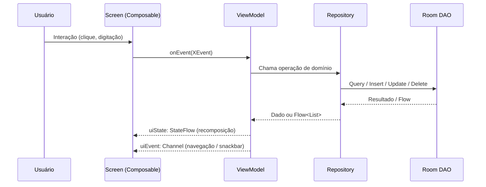
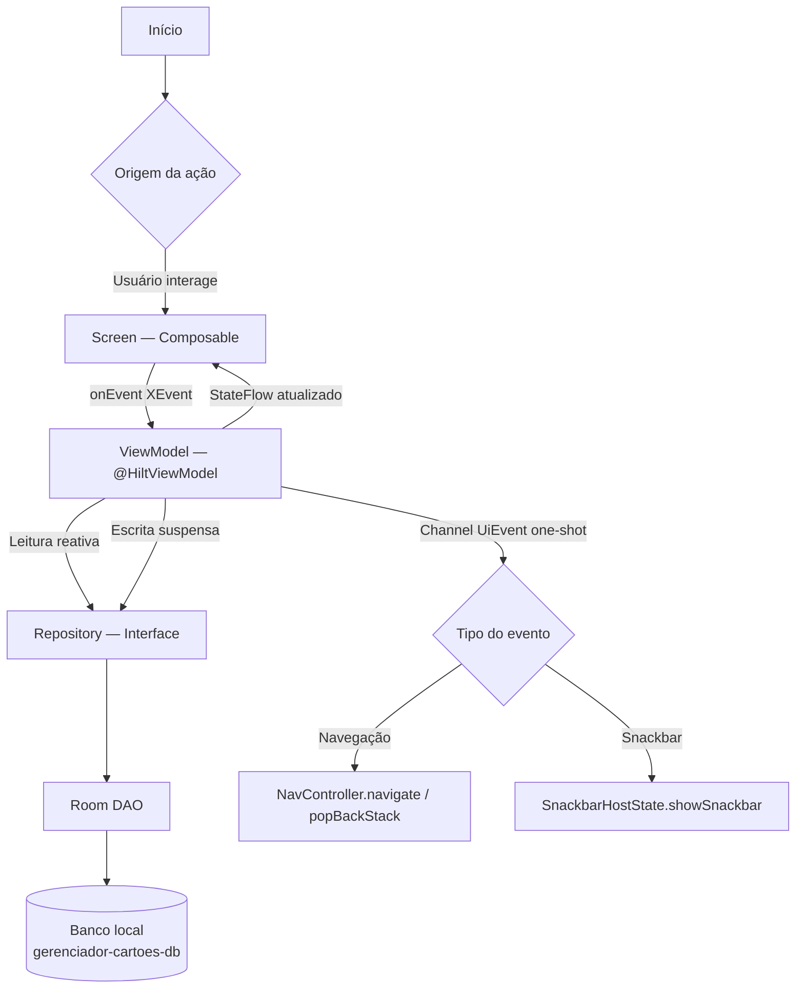
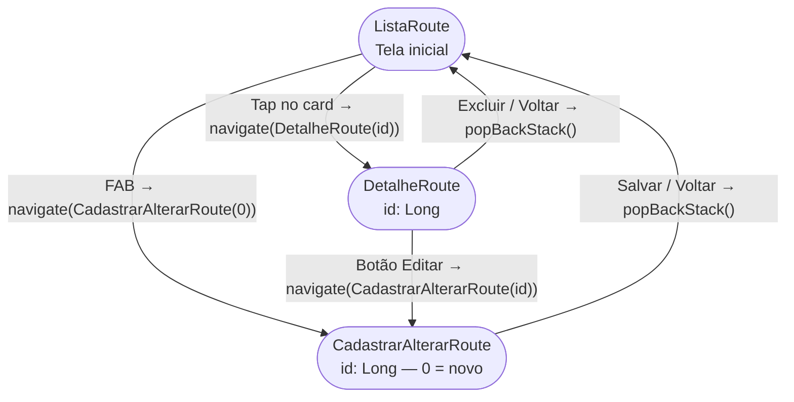

# Documentação Técnica — G3 Bank

> Documentação técnica completa de arquitetura, stack, padrões e guias de desenvolvimento.  
> Para visão geral do projeto consulte o [README.md](../README.md).

---

## Índice

- [Stack & Versões](#stack--versões)
- [Dependências em Detalhe](#dependências-em-detalhe)
- [Arquitetura](#arquitetura)
- [Navegação](#navegação)
- [Estrutura de Pacotes](#estrutura-de-pacotes)
- [Guia de Camadas](#guia-de-camadas)
- [Como Adicionar uma Nova Feature](#como-adicionar-uma-nova-feature)
- [Padrões MVVM Obrigatórios](#padrões-mvvm-obrigatórios)

---

## Stack & Versões

| Tecnologia              | Versão     | Grupo / Artefato                                          |
|-------------------------|------------|-----------------------------------------------------------|
| Kotlin                  | 2.3.21     | `org.jetbrains.kotlin`                                    |
| AGP                     | 9.0.0      | `com.android.tools.build:gradle`                          |
| KSP                     | 2.3.6      | `com.google.devtools.ksp`                                 |
| Compose BOM             | 2026.05.00 | `androidx.compose:compose-bom`                            |
| Navigation Compose      | 2.9.0      | `androidx.navigation:navigation-compose`                  |
| Hilt                    | 2.59.2     | `com.google.dagger:hilt-android`                          |
| Hilt Navigation Compose | 1.2.0      | `androidx.hilt:hilt-navigation-compose`                   |
| Room                    | 2.8.4      | `androidx.room:room-runtime`                              |
| Retrofit                | 3.0.0      | `com.squareup.retrofit2:retrofit`                         |
| OkHttp                  | 5.3.2      | `com.squareup.okhttp3:logging-interceptor`                |
| kotlinx-serialization   | 1.11.0     | `org.jetbrains.kotlinx:kotlinx-serialization-json`        |
| Serialization Converter | 3.0.0      | `com.squareup.retrofit2:converter-kotlinx-serialization` |

---

## Dependências em Detalhe

### 🔧 KSP — Kotlin Symbol Processing
`com.google.devtools.ksp` · v2.3.6

Processador de código em tempo de compilação que **substitui o KAPT**. Gera o código boilerplate das anotações do Hilt e do Room sem precisar compilar em Java.

**Por que usar:**
- até 2× mais rápido que KAPT em builds incrementais
- compatível com Kotlin 2.x e com o compilador K2
- obrigatório para Hilt e Room nas versões atuais

```kotlin
// app/build.gradle.kts
plugins {
    alias(libs.plugins.ksp)
}
dependencies {
    ksp(libs.hilt.compiler)
    ksp(libs.androidx.room.compiler)
}
```

---

### 💉 Hilt — Dagger Hilt
`com.google.dagger:hilt-android` · v2.59.2

Framework de **injeção de dependência** construído sobre o Dagger.

| Anotação | Onde | O que faz |
|----------|------|-----------|
| `@HiltAndroidApp` | `GerenciadorCartoesApp` | Inicializa o grafo de DI na Application |
| `@AndroidEntryPoint` | `MainActivity` | Permite injeção na Activity |
| `@HiltViewModel` | ViewModels | Permite injeção de dependências no ViewModel |
| `@Inject constructor` | Impl classes | Marca o construtor que o Hilt deve usar |
| `@Binds` | `AppModule` | Vincula a interface `CartaoRepository` → `CartaoRepositoryImpl` |
| `@Provides` | `AppModule` | Cria instâncias de tipos externos (Room, Retrofit) |
| `@Singleton` | Módulos | Garante uma única instância por Application |

```kotlin
@HiltViewModel
class ListaViewModel @Inject constructor(
    private val cartaoRepository: CartaoRepository,
) : ViewModel()
```

---

### 🔗 Hilt Navigation Compose
`androidx.hilt:hilt-navigation-compose` · v1.2.0

Integração entre Hilt e Navigation Compose. Permite usar `hiltViewModel()` dentro de `composable<T> {}` com escopo correto ao destino de navegação.

```kotlin
@Composable
fun DetalheScreen(
    navigateBack : () -> Unit,
    viewModel    : DetalheViewModel = hiltViewModel(),
)
```

---

### 🗄️ Room
`androidx.room:room-runtime` + `room-ktx` · v2.8.4

Camada de abstração sobre o **SQLite** que valida queries em tempo de compilação.

| Anotação/Tipo | Arquivo | Função |
|---------------|---------|--------|
| `@Entity` | `CartaoEntity` | Mapeia a classe para a tabela `cartoes` |
| `@PrimaryKey(autoGenerate)` | `CartaoEntity` | Chave primária auto-incrementada |
| `@Dao` | `CartaoDao` | Interface com as queries da tabela |
| `@Query` | `CartaoDao` | SQL inline validado em compile-time |
| `@Insert` / `@Update` | `CartaoDao` | Operações de escrita |
| `@Database` | `AppDatabase` | Declara o banco e os DAOs disponíveis |
| `Flow<List<T>>` | `CartaoDao` | Leitura reativa — UI recompõe ao mudar dados |

```kotlin
@Query("SELECT * FROM cartoes ORDER BY nomeTitular ASC")
fun observarTodos(): Flow<List<CartaoEntity>>

@Query("SELECT * FROM cartoes WHERE id = :id")
fun observarPorId(id: Long): Flow<CartaoEntity?>
```

---

### 🌐 Retrofit
`com.squareup.retrofit2:retrofit` · v3.0.0

Cliente HTTP type-safe para **consumo de APIs REST**. A infraestrutura (Retrofit + OkHttp + ApiService) está provisionada em `NetworkModule`. Os endpoints serão adicionados em `ApiService` conforme necessidade.

```kotlin
interface ApiService {
    @GET("cartoes")
    suspend fun listarCartoes(): List<CartaoResponse>

    @POST("cartoes")
    suspend fun criarCartao(@Body body: CartaoRequest): CartaoResponse
}
```

---

### 🔍 OkHttp Logging Interceptor
`com.squareup.okhttp3:logging-interceptor` · v5.3.2

Interceptor que **loga todas as requisições e respostas HTTP** no Logcat em modo debug.

```kotlin
OkHttpClient.Builder()
    .addInterceptor(
        HttpLoggingInterceptor().apply {
            level = HttpLoggingInterceptor.Level.BODY
        }
    )
    .build()
```

---

### 📦 kotlinx-serialization
`org.jetbrains.kotlinx:kotlinx-serialization-json` · v1.11.0

Dois usos distintos no projeto:

| Uso | Como | Onde |
|-----|------|------|
| Rotas de navegação type-safe | `@Serializable` nas data classes de rota | `Routes.kt` |
| Desserialização de respostas HTTP | `json.asConverterFactory()` no Retrofit | `NetworkModule.kt` |

```kotlin
// Uso 1 — rotas type-safe
@Serializable
data class DetalheRoute(val id: Long)

// Uso 2 — conversor de JSON para Retrofit
Retrofit.Builder()
    .addConverterFactory(json.asConverterFactory("application/json".toMediaType()))
```

---

### 🧭 Navigation Compose 2 (type-safe)
`androidx.navigation:navigation-compose` · v2.9.0

Rotas são `@Serializable data class` — os parâmetros são verificados pelo compilador.

```kotlin
navController.navigate(DetalheRoute(id = cartao.id))

private val route: DetalheRoute = savedStateHandle.toRoute()
private val id: Long = route.id
```

---

### 🔴 Lifecycle ViewModel Compose + Runtime Compose
`androidx.lifecycle:lifecycle-viewmodel-compose` · v2.10.0  
`androidx.lifecycle:lifecycle-runtime-compose` · v2.10.0

| Artefato | O que fornece | Onde é usado |
|----------|--------------|--------------|
| `lifecycle-viewmodel-compose` | `hiltViewModel()` | Todas as Screens |
| `lifecycle-runtime-compose` | `collectAsStateWithLifecycle()` | Todas as Screens |

**Por que `collectAsStateWithLifecycle()` em vez de `collectAsState()`:**  
Respeita o ciclo de vida — para de coletar quando a tela vai para background, evitando consumo desnecessário de bateria.

---

## Arquitetura

### Fluxo de Evento



### Diagrama de Camadas



---

## Navegação

### Diagrama



### Rotas

```kotlin
@Serializable object ListaRoute
@Serializable data class DetalheRoute(val id: Long)
@Serializable data class CadastrarAlterarRoute(val id: Long = 0L) // 0 = cadastrar, >0 = editar
```

---

## Estrutura de Pacotes

```
com.app.gerenciadorcartoes/
│
├── GerenciadorCartoesApp.kt     → @HiltAndroidApp
├── MainActivity.kt              → @AndroidEntryPoint + setContent
│
├── model/
│   └── Cartao.kt                → Modelo de domínio
│
├── data/local/
│   ├── dao/CartaoDao.kt         → Queries Room (@Dao)
│   ├── database/AppDatabase.kt  → @Database
│   └── entity/CartaoEntity.kt   → @Entity Room
│
├── repository/
│   ├── CartaoRepository.kt      → Interface de domínio
│   ├── CartaoRepositoryImpl.kt  → Implementação Room
│   └── mapper/CartaoMapper.kt   → CartaoEntity ↔ Cartao
│
├── network/
│   └── service/ApiService.kt    → Interface Retrofit (endpoints futuros)
│
├── di/
│   ├── AppModule.kt             → Room + CartaoRepository
│   └── NetworkModule.kt         → Retrofit + OkHttp + ApiService
│
└── ui/
    ├── theme/                   → Color, Theme, Type, Shape, Spacing, IconSize
    ├── components/              → AppScaffold, AppTopAppBar, AppLoading, EmptyState
    ├── navigation/              → Routes.kt + AppNavHost.kt
    ├── feature/
    │   ├── lista/               → Screen, Event, UiEvent, state/UiState
    │   ├── detalhe/             → Screen, Event, UiEvent, state/UiState
    │   └── cadastraralterar/    → Screen, Event, UiEvent, state/UiState
    └── viewmodel/               → ListaViewModel, DetalheViewModel, CadastrarAlterarViewModel
```

---

## Guia de Camadas

> **Regra de ouro:** cada camada conhece somente as camadas abaixo dela. A UI nunca importa `CartaoEntity` nem `CartaoDao`.

### `model/`
Modelo de domínio puro — zero dependência de framework.

```kotlin
// ✅ correto
data class Cartao(
    val id          : Long   = 0L,
    val nomeTitular : String = "",
    val limite      : Double = 0.0,
)
```

### `data/local/entity/`
Representação do registro no banco SQLite.

```kotlin
@Entity(tableName = "cartoes")
data class CartaoEntity(
    @PrimaryKey(autoGenerate = true) val id: Long = 0L,
    val nomeTitular : String,
    val limite      : Double,
)
```

### `data/local/dao/`
Interface de acesso ao banco — só queries Room.

```kotlin
@Dao
interface CartaoDao {
    @Query("SELECT * FROM cartoes ORDER BY nomeTitular ASC")
    fun observarTodos(): Flow<List<CartaoEntity>>

    @Insert(onConflict = OnConflictStrategy.REPLACE)
    suspend fun inserir(entity: CartaoEntity): Long
}
```

### `data/local/database/`
Único arquivo que declara o `RoomDatabase`.

```kotlin
@Database(entities = [CartaoEntity::class], version = 1, exportSchema = false)
abstract class AppDatabase : RoomDatabase() {
    abstract fun cartaoDao(): CartaoDao
}
```

### `repository/`
Interface de domínio + implementação. Isola a UI do Room/Retrofit.

```kotlin
interface CartaoRepository {
    fun observarTodos(): Flow<List<Cartao>>
    suspend fun salvar(cartao: Cartao): Long
}

class CartaoRepositoryImpl @Inject constructor(
    private val dao: CartaoDao,
) : CartaoRepository {
    override fun observarTodos() = dao.observarTodos().map { it.map(CartaoEntity::toDomain) }
    override suspend fun salvar(cartao: Cartao) = dao.inserir(cartao.toEntity())
}
```

### `repository/mapper/`
Conversão entre `CartaoEntity` ↔ `Cartao`.

```kotlin
fun CartaoEntity.toDomain(): Cartao = Cartao(id = id, nomeTitular = nomeTitular, ...)
fun Cartao.toEntity(): CartaoEntity = CartaoEntity(id = id, nomeTitular = nomeTitular, ...)
```

### `di/`
Módulos Hilt que constroem e vinculam dependências.

```kotlin
@Module @InstallIn(SingletonComponent::class)
abstract class AppModule {

    @Binds @Singleton
    abstract fun bindCartaoRepository(impl: CartaoRepositoryImpl): CartaoRepository

    companion object {
        @Provides @Singleton
        fun provideDatabase(@ApplicationContext ctx: Context): AppDatabase =
            Room.databaseBuilder(ctx, AppDatabase::class.java, "gerenciador-cartoes-db").build()

        @Provides @Singleton
        fun provideCartaoDao(db: AppDatabase): CartaoDao = db.cartaoDao()
    }
}
```

### `ui/theme/`

| Arquivo | O que define |
|---------|-------------|
| `Color.kt` | Paleta Electric Blue + Purple accent (MD3) |
| `Theme.kt` | `GerenciadorCartoesTheme` com suporte Light/Dark |
| `Type.kt` | Escala tipográfica Material 3 |
| `Spacing.kt` | Tokens: `extraSmall(4)` `small(8)` `medium(16)` `large(24)` `extraLarge(32)` |
| `IconSize.kt` | Tokens: `small(20)` `medium(24)` `large(40)` `extraLarge(48)` |

### `ui/components/`
Composables reutilizáveis agnósticos a feature.

| Componente | Responsabilidade |
|---|---|
| `AppScaffold` | Scaffold padrão com Snackbar + FAB + TopBar |
| `AppTopAppBar` | Barra de navegação com suporte a leadingIcon, back, actions, Light/Dark |
| `AppLoading` | Indicador de carregamento centralizado |
| `EmptyState` | Tela vazia com título, subtítulo e ícone |
| `ConfirmacaoDialog` | Dialog de confirmação genérico (confirmar/cancelar) |
| `CartaoTemplateCard` | Visual completo do cartão de crédito/débito |

### `ui/viewmodel/`

```kotlin
@HiltViewModel
class ListaViewModel @Inject constructor(
    private val cartaoRepository: CartaoRepository,
) : ViewModel() {

    private val _uiState = MutableStateFlow(ListaUiState(carregando = true))
    val uiState: StateFlow<ListaUiState> = _uiState.asStateFlow()

    private val _uiEvent = Channel<ListaUiEvent>(Channel.BUFFERED)
    val uiEvent = _uiEvent.receiveAsFlow()

    init { observarCartoes() }

    fun onEvent(event: ListaEvent) {
        when (event) {
            is ListaEvent.ExcluirCartao -> excluir(event.id)
            // ...
        }
    }
}
```

---

## Como Adicionar uma Nova Feature

1. **Criar os arquivos** em `ui/feature/<nome>/`:

   | Arquivo | Responsabilidade |
   |---|---|
   | `<Nome>Screen.kt` | `XScreen` + `XContent` + `@Preview` |
   | `<Nome>Event.kt` | `sealed interface` com as ações do usuário |
   | `<Nome>UiEvent.kt` | `sealed interface` one-shot (navegação, snackbar) |
   | `state/<Nome>UiState.kt` | `data class` imutável — todo o estado visual |

2. **Criar o ViewModel** em `ui/viewmodel/` com `@HiltViewModel`

3. **Declarar a rota** em `ui/navigation/Routes.kt`

4. **Registrar** `composable<NovaRoute> {}` em `AppNavHost.kt`

5. **Criar módulo Hilt** em `di/` se precisar de novos repositórios

---

## Padrões MVVM Obrigatórios

| Camada | Regra |
|--------|-------|
| Screen | `XScreen` coleta ViewModel; `XContent` recebe estado puro; `@Preview` chamam `XContent` |
| ViewModel | `@HiltViewModel`; expõe `StateFlow<UiState>` + `Flow<UiEvent>` via Channel |
| UiState | `data class` imutável; atualizado via `_uiState.update {}` |
| Event | `sealed interface`; representa intenção do usuário |
| UiEvent | `sealed interface`; one-shot via `Channel.BUFFERED` |
| Repository | Interface no domínio; implementação na camada de dados; injetada via Hilt |

---

*Documentação gerada e mantida junto ao código-fonte. Atualize sempre que alterar arquitetura, rotas ou dependências.*

